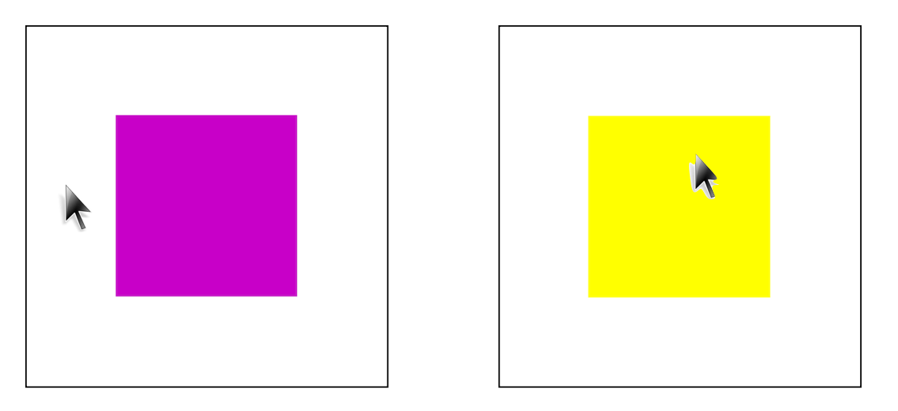

# Creative Coding For Beginners
  
Prof. Dr. Lena Gieseke \| l.gieseke@filmuniversitaet.de  
  
  
# Exercise 03 - Conditionals

This session is due on **Monday, May 29th**.  

* [Creative Coding For Beginners](#creative-coding-for-beginners)
* [Exercise 03 - Conditionals](#exercise-03---conditionals)
    * [Task 03.01 - Scripts](#task-0301---scripts)
    * [Task 03.02 - Program Understanding](#task-0302---program-understanding)
    * [Task 03.03 - Variables](#task-0303---variables)
    * [Task 03.04 - Conditionals](#task-0304---conditionals)


## Task 03.01 - Scripts

Recap the script:

* [Script 06 - Conditionals](../../02_scripts/ccfb_ss23_06_conditionals_script.md)

*Submission*: -

## Task 03.02 - Program Understanding

Understand and explain the [following code](https://editor.p5js.org/legie/sketches/4fWUhh9C8):

```js
function setup() {
    createCanvas(400, 400);

    colorMode(HSB);
    background(100);
    noStroke();
}

function draw() {
  
    // Quad top-left
    fill(120, 40, 100);
    rect(0, 0, 200, 200);

    // Quad top-right
    fill(160, 40, 100);
    rect(200, 0, 200, 200);

    // Quad bottom-left
    fill(180, 40, 100);
    rect(0, 200, 200, 400);

    // Quad bottom-right
    fill(200, 40, 100);
    rect(200, 200, 400, 400);

    
    
    // What is happening in the following?
    if ((mouseX > 0) & (mouseX < 200) & (mouseY > 0) & (mouseY < 200)) {
        
        fill(120, 100, 100);
        rect(0, 0, 200, 200);
        
        if(mouseIsPressed == true) {
            rect(0, 0, 202, 202);
        }
        
    } else if ((mouseX > 200) & (mouseX < 400) & (mouseY > 0) & (mouseY < 200)) {
        
        fill(160, 100, 100);
        rect(200, 0, 200, 200);
            
        if(mouseIsPressed == true) {
            rect(198, 0, 202, 202);
        }
        
    } else if ((mouseX > 0) & (mouseX < 200) & (mouseY > 200) & (mouseY < 400)) {
        
        fill(180, 100, 100);
        rect(0, 200, 200, 400);
        
        if(mouseIsPressed == true) {
            rect(0, 198, 202, 202);
        }
        
    } else if ((mouseX > 200) & (mouseX < 400) & (mouseY > 200) & (mouseY < 400)) {
        
        fill(200, 100, 100);
        rect(200, 200, 400, 400);
        
        if(mouseIsPressed == true) {
            rect(198, 198, 202, 202);
        }
        
    }
}

```

*Submission*: Add a link to your sketch in your OwnCloud file. The sketch should be a copy of the code above with your explanatory comments in it.


## Task 03.03 - Variables

Improving your programming skills is a life long tasks. One of the skills of good programmers is to being able to access and learn new aspects about programming on their own. In this tasks you practice to understand new content on your own. For that read [Script 07 - Variables](). This script explains topics that we haven't covered in class yet. Try to understand variables as best as you can but also worry not! We will go over the most important aspects one more time in class.

```diff
The script is not ready yet. I will add it by the end of the week!
```

*Submission*: -

## Task 03.04 - Conditionals

Create a sketch up to your liking and that [uses at least one `if`-statement](https://editor.p5js.org/legie/sketches/0lByVe-mH). The sketch does not need to be particularly creative or beautiful. The goal is to practice the learned functionalities. If you want to and feel up tp it, you can make use of variables (see Task 03.03) but you absolutely don't have to!

If you can not think of a task, your could try to implement from scratch a box that changes the color when you hover with the mouse over the box:



  

*Submission*: Add a link to your sketch in your OwnCloud file.

---

*Happy Conditioning!*
