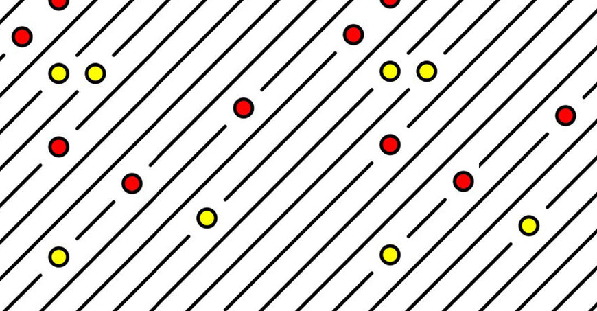

# Creative Coding For Beginners
  
Prof. Dr. Lena Gieseke \| l.gieseke@filmuniversitaet.de  
  
  
# Exercise 05 - Loops

This session is due on **Monday, June 19th**.  

* [Creative Coding For Beginners](#creative-coding-for-beginners)
* [Exercise 05 - Loops](#exercise-05---loops)
    * [Task 05.01 - A Grid Pattern](#task-0501---a-grid-pattern)
            * [Task 05.02 - Interactive Parameters](#task-0502---interactive-parameters)

## Task 05.01 - A Grid Pattern

Write a sketch that generates a pattern with a similar logic as the 10 PRINT example. You can use the code from the script as basis. Ideally, your pattern should follow an element-by-element and row-by-row iterative creation process - but don't feel limited be this. If you have other ideas for creating a pattern, go for it! The overall goal is to create a visual pleasing or interesting pattern up to your liking.  

Here an example:

*Submission*: Add a link to the example and your explanation as text in your OwnCloud file.

#### Task 05.02 - Interactive Parameters

Make your pattern interactive by mapping at least one changeable visual characteristics to, e.g., the mouse and / or keys.

*Submission*: Add a link to the example and your explanation as text in your OwnCloud file.

---

*Happy Looping!*
