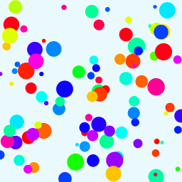

# Creative Coding For Beginners
  
Prof. Dr. Lena Gieseke \| l.gieseke@filmuniversitaet.de  
  
  
# Exercise 06 - Algorithms and Images

This session is due on **Monday, July 3rd**.  


---

* [Creative Coding For Beginners](#creative-coding-for-beginners)
* [Exercise 06 - Algorithms and Images](#exercise-06---algorithms-and-images)
    * [Task 07.01 - Arrays](#task-0701---arrays)
    * [Task 07.02 - Confetti](#task-0702---confetti)
    * [Task 07.03 - Functions](#task-0703---functions)


## Task 07.01 - Arrays

* Re-cap [Script 10 - Arrays](../../02_scripts/ccfb_ss23_09_images_script.md) (I will add the script later)


## Task 07.02 - Confetti

Take the [animation of a circle code](https://editor.p5js.org/legie/sketches/JNJWuf7B7) and convert it to creating multiple circles (confetti!) at the same time. 

  
  

*Hints*:  
  
E.g., use the following globale variables for the task:

```js
let numCircles = 100;

let positionX = [];
let positionY = [];

let stepX = [];
let stepY = [];

let hue = [];
let radius = [];
```

To animate all circles and to access the arrays, use, e.g., a for-loop:

```js
...
for (let i = 0; i < numCircles; i++) {

    ...

    fill(hue[i], 100, 100);
    circle(positionX[i], positionY[i], radius[i]);

    ...
}
...
```

*Submission*: Add a link to your sketch in your OwnCloud file.

## Task 07.03 - Functions 

* Read [Script 11 - Functions](../../02_scripts/ccfb_ss23_11_functions_script.md)

Use the [code of step 2 of the game](https://editor.p5js.org/legie/sketches/m5Z-lTkXB) and add functions to the code to make it more readable. The goal is to keep `setup()` and `draw()` as organized as possible.

*Hints*:  

* I suggest two new functions for the player and two for the background.


*Submission*: Add a link to your sketch in your OwnCloud file.


---

*Happy Functioning!*
