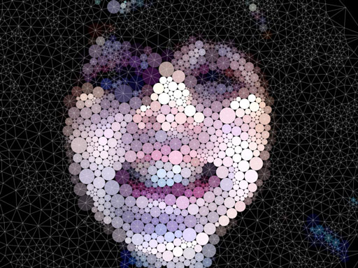
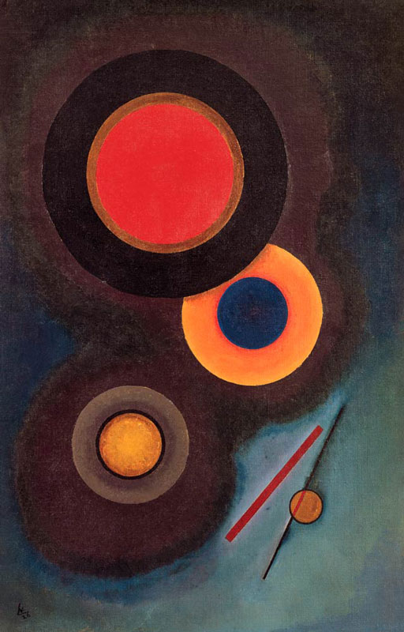

# Creative Coding For Beginners
  
Prof. Dr. Lena Gieseke \| l.gieseke@filmuniversitaet.de  
  

# Script 01 - Introduction

* [Creative Coding For Beginners](#creative-coding-for-beginners)
* [Script 01 - Introduction](#script-01---introduction)
    * [This Course](#this-course)
        * [Learning Objectives](#learning-objectives)
        * [Topics](#topics)
    * [References](#references)

---

## This Course

You might think that for doing cool, e.g. visual stuff with coding you need mountains of coding knowledge. That is not true. Even a with a beginners skill level you can do nice things.

Look for example at these different possibilities to do visual designs and even art with just an arrangement of circles!

  
[[Circle Packing, Miu Ling Lam, 2010.]](https://miulinglam.files.wordpress.com/2010/02/cp09.jpg)

  
[[Circle Packing, Miu Ling Lam, 2010.]](https://miulinglam.files.wordpress.com/2010/02/cp10.jpg)

  
[[Verschiedene Kreise (1926), Wassily Kandinsky.]](https://miulinglam.files.wordpress.com/2010/02/cp09.jpg)

  
[[Komposition mit Kreisen und Linien (1926), Wassily Kandinsky.]](https://miulinglam.files.wordpress.com/2010/02/cp09.jpg)

*Do you like the above examples and if so, why?*

### Learning Objectives

With this course, you will gain

* an understanding of programming,
* **skills to develop simple programs from scratch**,
    * Knowledge about resources
    * Guidance towards and learning through self-studies,
* skills to apply programming as (an expressive) tool.

### Topics

Class topics can be divided into what you learn about programming itself and its *syntax* and what you do with your newly developed programming skill, meaning its application.

In regard to programming itself, we will cover:

* Commands, variables
* Events
* Conditions
* Loops
* Arrays
* Functions

We apply these programming skills to implement:

* Drawing, colors
* Interaction
* Movement / Animation
* Text and Typography
* Image, video
* Sound

<!-- 
## Introductions

* What is you background?
* Why do you want to learn programming? 
-->

## References

[[1] Wikipedia - Liste von Hallo-Welt-Programmen/Höhere Programmiersprachen](https://de.wikipedia.org/wiki/Liste_von_Hallo-Welt-Programmen/H%C3%B6here_Programmiersprachen)  

---

*The End*  

💪🏾 💪🏻 💪