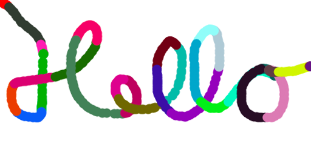
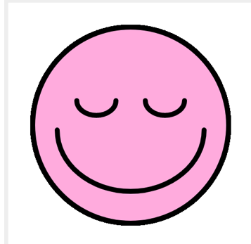

name: inverse
layout: true
class: center, middle, inverse
---

# Creative Coding for Beginners
### Film University Babelsberg KONRAD WOLF

Prof. Dr. Lena Gieseke | l.gieseke@filmuniversitaet.de 


---
template:inverse

# Program Flow & Interaction


???
.task[COMMENT:]  

* User Interaction is heavily influencing the flow of a program...

---
layout:false

## Program Flow & Interaction

.center[]

---
## Program Flow & Interaction

<script type="text/p5" data-p5-version="1.6.0" data-autoplay data-height="500" data-preview-width="680" >
function setup() {
    createCanvas(360, 360);
    background (255);
    fill(255, 0, 0);
    noStroke();
}

function draw() {
    ellipse(mouseX, mouseY, 20, 20);
}

// Called if the mouse was pressed
function mousePressed() {

    // Set the fill color to
    // randomly chosen values
    fill(random(255), random(255), random(255));
}
</script>

---
.header[Program Flow & Interaction]

## Learning Objectives

With this lecture you 

--
* re-cap the basics of how code is structured and executed,

--
* re-cap what function definition and function calls are,

--
* know how to implement user mouse and key inputs,

--
* with that understand how you can control the flow of a program.


---

## Program Flow

--

Program flow refers here to the order in which commands and function calls are *executed*.  
--

* How you arrange the code in the code file has little to do with the order in which commands are executed.
--

* Execution order depends on constructs such as functions, if-, and while-statements.

--
    * {}
    * Function calls
    * User interaction
    * `if`-condition


---
template:inverse

Program Flow 

## Curly Brackets { }

---
.header[Program Flow]

## Curly Brackets `{}`

The most important component for understanding program flow are `{}`. 

--
* The brackets create *one block of code*. 
* Code inside of the `{}` is executed line by line. 

---
.header[Program Flow]

## Curly Brackets `{}`

`{}` are attached to different types of *program flow entities*, such as functions.

```js
function draw() {

    // Code block 
}
```

--

These entities have a "title line" indicating, what is defined in the following code block, followed by the `{}` for the actual code.

--

```js
function draw() { // "title line" + open bracket 

    // Code block 
}
```

---
.header[Program Flow]

## Curly Brackets `{}`

### The `if` Statement

We check for a condition to be true:

```js
// Pseudo code

if(condition is true) {

    // do this…
}
```

--
```js
let points = 75;

if (points >= 50) {
    print("you won");
}
```

---
.header[Program Flow]

## Curly Brackets `{}`

### The `if` Statement

We check for a condition to be true:

```js
// Pseudo code

if(condition is true) {

    // do this…
}
```

Once again we have the structure:

```js
// Pseudo code

if(condition is true) { // title line with opening bracket

    // Code

} // Closing bracket 
```


---
.header[Program Flow]

## Curly Brackets `{}`


Get in the habit of directly after writing the opening `{`, to also write the closing `}`.  

???
.task[COMMENT:]  

* textThey are BFFs and always, always appear together. Hence, write them together and then fill in the code inside of the brackets in the next step.

--

1.
```js
function draw() {}
```
--

2.
```js
function draw() {

    ellipse();
}
```
--

3.
```js
function draw() {

    ellipse(10, 10, 10, 10);
}
```
--

There is NEVER the case that you have only one of the brackets. 

---
.header[Program Flow]

## Curly Brackets `{}`

When trying to understand the flow of a program, look for the brackets first. They give you an understanding of the different code blocks.

--

Within `{}` code is indented, meaning the layout of the code represents the logic of "code inside of a block":

```js
{
    // CODE PUT AFTER 4 SPACES OR 1 TAB
}


```


---
template:inverse

Program Flow 

## Functions

---
.header[Program Flow]

## Functions

So far, we have used different function calls for drawing.

```js
line(10, 10, 50, 50);
```


???
.task[COMMENT:]  

* This is the call to the function `line`

--

This means we are calling the function `line`, to be executed, which is the task of drawing a line from the point 10, 10 to the point 50, 50.

--

But where is it defined how the line is actually drawn, meaning the coloring of the pixels?

--

Well somewhere inside the p5 library. 


???
.task[COMMENT:]  

* Similar to if we were baking a pizza and we are using a can of pre-made tomato sauce. `line` is the tomate sauce. We can just use it and do not need to worry about how it is defined.

---
.header[Program Flow]

## Functions

`line()` is a pre-defined function, which we don't have to make from scratch but that we can simply use.

But somewhere [inside the p5 library](https://github.com/processing/p5.js/blob/main/src/core/shape/2d_primitives.js) there must be defined what should actually happen if the function `line()` is called. This is called a *function definition*.

---
.header[Program Flow]

## Function Definition

```js
function functionname(){

    // Code that is executed when we call the function
}
```

To define a function you need the keyword `function` followed by a `functionname` (given or of your choice), followed by `()`, followed by `{...}`.  

What a function does is enclosed in the curly brackets.

--

Functions define functionality blocks with fixed responsibilities or tasks.  

---
.header[Program Flow]

## Function Definition

Working with functions consists of two parts: 

* the definition of that function and 
* calling that function to execute it.


---
.header[Program Flow]

## Function Definition

With our current knowledge we could define a `line()` function as follow:

```js
function theBestLineEverDrawn(x1, y1, x2, y2) {
    beginShape();
    vertex(x1, y1);
    vertex(x2, y2);
    endShape();
}
```

--

Later on, we will frequently write functions from scratch. Don't worry about writing you own functions for now. Here we are talking about it in order to understand the flow of a program.

---
.header[Program Flow]

## Function Call

To execute what is inside of a function, you have to call it.  

You call a function with its `functionname`, followed by `()`, optional arguments inside of those parenthese, followed by a `;` as last element. We know this already.

--


```js
function theBestLineEverDrawn(x1, y1, x2, y2) {
    beginShape();
    vertex(x1, y1);
    vertex(x2, y2);
    endShape();
}

…

theBestLineEverDrawn(10, 10, 20, 20); // Calling the function somewhere in the code
```

---
.header[Program Flow]

## Function Call


<script type="text/p5" data-p5-version="1.6.0" data-autoplay data-height="500" data-preview-width="380" >
function setup() {
    createCanvas(500, 500);
    background(255, 255, 0);
    strokeWeight(10);
    stroke(0, 0, 255);
}

function draw() {
    line(100,100,400,400);
}
</script>


---
.header[Program Flow]

## Function Call


<script type="text/p5" data-p5-version="1.6.0" data-autoplay data-height="500" data-preview-width="280" >
function setup() {
    createCanvas(500, 500);
    background(255, 255, 0);
    strokeWeight(10);
    stroke(0, 0, 255);
}

// Here the function is only defined,
// not yet called
function theBestLineEverDrawn(x1, y1, x2, y2) {
    beginShape();
    vertex(x1, y1);
    vertex(x2, y2);
    endShape();
}

function draw() {
    // Here, we actually call the 
    // function theBestLineEverDrawn and it is
    // executed.
    theBestLineEverDrawn(100,100,400,400);
}
</script>

---
.header[Program Flow | Functions]

## System Loop

```javascript
function setup() {

    [HERE YOU WRITE YOUR CODE]
}

function draw() {

    [HERE YOU WRITE YOUR CODE]
}
```

We define the functions `setup` and `draw` and p5 calls them for us when running a program.


---
template:inverse

# Interaction


???
.task[COMMENT:]  

* User Interaction is heavily influencing the flow of a program...


---
## Interaction

<script type="text/p5" data-p5-version="1.6.0" data-autoplay data-height="500" data-preview-width="380" >
function setup() {
    createCanvas(360, 360);
    background (255);
    fill(255, 0, 0);
    noStroke();
}

function draw() {
    ellipse(180, 180, 100, 100);
}
</script>

As the `draw()` function is continuously called, we can make changes to it over time.

Such changes could be based on **user interaction**


---
## Mouse Interaction

```js

function mousePressed() {

    // Define what should happen
}
```

With the above function definition we can control what should happen if the mouse was pressed. 

---
## Mouse Interaction


*If the mouse was pressed, change the color of the circle.*  

--
<script type="text/p5" data-p5-version="1.6.0" data-autoplay data-height="450" data-preview-width="380" >
function setup() {
    createCanvas(360, 360);
    background (255);
    fill(255, 0, 0);
    noStroke();
}

function draw() {
    ellipse(180, 180, 100, 100);
}

function mousePressed() {
    // Define what should happen
}
</script>

--

*Any ideas?*

---
## Mouse Interaction

*If the mouse was pressed, change the color of the circle.*  

<script type="text/p5" data-p5-version="1.6.0" data-autoplay data-height="450" data-preview-width="380" >
function setup() {
    createCanvas(360, 360);
    background (255);
    fill(255, 0, 0);
    noStroke();
}

function draw() {
    ellipse(180, 180, 100, 100);
}

// Called if the mouse was pressed
function mousePressed() {
    fill(0, 0, 255);
}
</script>

---
## Mouse Interaction

*If the mouse was pressed, change the color of the circle.*  

<script type="text/p5" data-p5-version="1.6.0" data-autoplay data-height="450" data-preview-width="380" >
function setup() {
    createCanvas(360, 360);
    background (255);
    fill(255, 0, 0);
    noStroke();
}

function draw() {
    ellipse(180, 180, 100, 100);
}

function mousePressed() {
    fill(random(255), random(255), random(255));
}
</script>


---
## The `random` Function

--

The random function generates a random number 😁.

```js
random(-50, 50);
```

When we call this function, it *returns* a value, the random number.  

--

Some where in p5 we have a function definition similar to:

```js
function random(rangeStart, rangeEnd) {
    
    //generate a random number within the range

    return value;
}
```

---
## The `random` Function


We are directly piping the return value of the random function as argument into the `fill(r, g, b)` function call: 

```js
fill(random(255), random(255), random(255));
```


--

Functions can be nested. As of now, this should remain an exception for us!

--

```js
let myRed = random(255);
let myGreen = random(255);
let myBlue = random(255);

fill(myRed, myGreen, myBlue);
```


---
## The `random` Function


Each time the `random()` function is called, it returns a value within the specified range.

--
* `random(-5, 5)` returns values between -5 and 5 (starting at -5, and up to, but not including, 5)
  
--
  
If only one argument is passed to the function, it will return a float between zero and the value of the argument.

--
* `random(5)` returns values between 0 and 5 (starting at zero, and up to, but not including, 5)
  
--
  
### https://p5js.org/reference/#/p5/random 🚑 🚨


???
.task[COMMENT:]  

* Go through reference

---
.header[Program Flow]

## Careful

*Why does the following not work?*

<script type="text/p5" data-p5-version="1.6.0" data-autoplay data-height="450" data-preview-width="280" >
function setup() {
    createCanvas(360, 360);
    background (255);
    noStroke();
}

function draw() {
    fill(255, 0, 0);
    ellipse(180, 180, 100, 100);
}

function mousePressed() {
    fill(random(255), random(255), random(255));
}
</script>


---
## Mouse Position

We can also use the current mouse position as input.  

This is not done with a function but with two values, so called **variables** provided by p5.  

--

```js
mouseX
mouseY
```

--
  
This specific type of variable is called *system variable*.  


???
.task[COMMENT:]  

* System variable are the variables that are given from the system in contrast to the variables that you are going to define yourself. We will come back to this.

--

They are given to us by p5 🎁.


--

For now you can just remember that "inside" of `mouseX` we can access the current mouse position in x at all times, and in `mouseY` the current mouse position in y.


???
.task[COMMENT:]  

* We still need to learn all about variables. This is not the time. 

---
## Mouse Position

<script type="text/p5" data-p5-version="1.6.0" data-autoplay data-height="450" data-preview-width="280" >
function setup() {
    createCanvas(360, 360);
    background (255);
    noStroke();
}

function draw() {
    ellipse(180, 180, 100, 100);
}

function mousePressed() {
    fill(random(255), random(255), random(255));
}
</script>


???
.task[COMMENT:]  

* Where should I put mouseX and mouseY? ellipse(mouseX, mouseY, 100, 100);


---
template:inverse

## Keyboard Interaction


---

## Keyboard Interaction

Similar to the mouse pressed function, we can define what should happen if a key is pressed:

--

```js
function keyPressed() {

    ...
}
```

Again, p5 calls this function for us whenever a key is pressed.

--

```js
// (the rest of the code remains the same)

function keyPressed() {

    fill(255);
}
```

---

## Keyboard Interaction


<script type="text/p5" data-p5-version="1.6.0" data-autoplay data-height="450" data-preview-width="380" >
function setup() {
    createCanvas(360, 360);
    background (255);
    noStroke();
}

function draw() {
    ellipse(mouseX, mouseY, 100, 100);
}

function mousePressed() {
    fill(random(255), random(255), random(255));
}

function keyPressed() {
    fill(255);
}
</script>


---
template:inverse

## Summary

---


## Summary

* `{}` define blocks of code.
    * Indent code inside of the blocks!
--
* Functions 
    * Functionality is defined with within `{}`
    * Need to be called in order for the code to execute.
--
* We can structure the program flow with user input
    * `mousePressed()`
    * `mouseX`, `mouseY`
    * `keyPressed()`

---
template:inverse

## Exercise

---
## Exercise

1. Draw the following house by *combining* shapes. 
2. Draw the same house with `beginShape` and `endShape`.  

.center[]

---
## Exercise

<script type="text/p5" data-p5-version="1.6.0" data-autoplay data-height="450" data-preview-width="380" >
function setup() {
    createCanvas(300, 300);
    background(255);
}

function draw() {

    // 1.
    rect(75, 150, 150, 150);
    triangle(75, 150, 225, 150, 150, 50);
  
    // 2.
    /*
    beginShape();
        vertex(75, 150);
        vertex(75, 300);
        vertex(225, 300);
        vertex(225, 150);
        vertex(75, 150);
        vertex(150, 50);
        vertex(225, 150);
    endShape();
    */
  
}
</script>


---
## Exercise

Draw a [creative image](https://editor.p5js.org/legie/sketches/ZGkf_1vzt) with simple shapes. This can be anything.

<script type="text/p5" data-p5-version="1.6.0" data-autoplay data-height="450" data-preview-width="380" >
// Source: https://happycoding.io/tutorials/p5js/calling-functions/circles

function setup() {
    createCanvas(300, 300);
    background(100, 255, 240);
    noFill();
    stroke(255, 240, 124);
    strokeWeight(8);
}

function draw() {

    // corner circles
    circle(0, 0, 300);
    circle(300, 0, 300);
    circle(0, 300, 300);
    circle(300, 300, 300);

    // top, bottom, left, and right circles
    circle(150, 0, 300);
    circle(150, 300, 300);
    circle(0, 150, 300);
    circle(300, 150, 300);

    // centered circles
    circle(150, 150, 300);
    circle(150, 150, 150);
}
</script>


---
## Exercise

Optional: Draw a smiley with simple shapes. For this task, you will need to have a look at [arcs](https://p5js.org/reference/#/p5/arc).  

.center[]

---
## Exercise

<script type="text/p5" data-p5-version="1.6.0" data-autoplay data-height="450" data-preview-width="380" >

function setup() {
    createCanvas(500, 500);
    strokeWeight(4);
    fill(255, 255, 0);
}


function draw() {
    
    ellipse(250, 250, 400, 400);
    arc(200, 250, 40, 80, radians(180), radians(360));
    arc(300, 250, 40, 80, radians(180), radians(360));
    arc(250, 260, 300, 250, 0, radians(180));
}
</script>


???
.task[COMMENT:]  

* If need be: [https://ctechfilmuniversity.github.io/lecture_ss23_creative_coding_for_beginners/02_scripts/ccfb_ss23_03_drawing_script.html#arc](https://ctechfilmuniversity.github.io/lecture_ss23_creative_coding_for_beginners/02_scripts/ccfb_ss23_03_drawing_script.html#arc)

---
## Exercise

Different color systems: let's use HSB!

[`colorMode()`](https://p5js.org/reference/#/p5/colorMode)


???
.task[COMMENT:]  

* https://py.processing.org/tutorials/color/
* https://helpx.adobe.com/illustrator/using/color.html#rgb_cmyk_hsb_and_lab_color_models
* https://en.wikipedia.org/wiki/HSL_and_HSV

--

`colorMode(HSB, 100);`


---
.header[Exercise]

## The HSB Color System

<script type="text/p5" data-p5-version="1.6.0" data-autoplay data-height="450" data-preview-width="380" >
function setup() {
    createCanvas(360, 360);
    background (255);
    noStroke();
}

function draw() {
    ellipse(mouseX, mouseY, 100, 100);
}

function mousePressed() {
    fill(random(255), random(255), random(255));
}

function keyPressed() {
    fill(255);
}
</script>


???
.task[COMMENT:]  

```
function setup() {
    createCanvas(360, 360);
    colorMode(HSB, 100);
  
    background (100);
    noStroke();
}

function draw() {
    ellipse(mouseX, mouseY, 100, 100);
}

function mousePressed() {
    fill(random(100), 100, 100);
}

function keyPressed() {
    fill(100);
}
```


---
.header[Exercise]

## The HSB Color System

[Result](https://editor.p5js.org/legie/full/mTNkNSaK5)

--
* How to draw the geometry?

--
* How to set the color?


???
.task[COMMENT:]  

* https://editor.p5js.org/

```js
function setup() {
  createCanvas(300, 300);
  
  colorMode(HSB, 300, 100, 100);
  background(100);
  strokeWeight(10);
}

function draw() {
  
}

function mousePressed() {
//function mouseDragged() {
    //strokeWeight(mouseY / 3);
    stroke(mouseX, 100, 100);
    line(mouseX, 0, mouseX, 300);
}
```


---
.header[Exercise]

## The System Loop

<script type="text/p5" data-p5-version="1.6.0" data-autoplay data-height="450" data-preview-width="300" >
function setup() {
    createCanvas(300, 300);
    
    colorMode(HSB, 300, 100, 100);
    background(100);
    strokeWeight(10);

}

function draw() {
    stroke(frameCount, 100, 100);
    line(frameCount, 0, frameCount, 300);
}
</script>


???
.task[COMMENT:]  

* frameRate(10);


---
.header[Exercise]

## The System Loop

<script type="text/p5" data-p5-version="1.6.0" data-autoplay data-height="450" data-preview-width="300" >
function setup() {
    createCanvas(300, 300);
    
    colorMode(HSB, 300, 100, 100);
    background(100);
    strokeWeight(10);

    noLoop();
}

function draw() {
    stroke(frameCount, 100, 100);
    line(frameCount, 0, frameCount, 300);
}

function mousePressed() {
    redraw();
}
</script>


???
.task[COMMENT:]  

* noLoop();
*  windowWidth / windowHeight 
    *  https://editor.p5js.org/legie/sketches/mTNkNSaK5


---
template:inverse


# *The End*  
  
# ⛵️  


