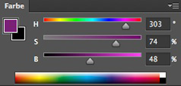
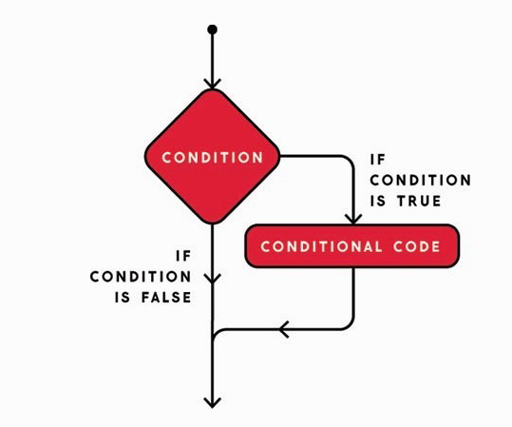

name: inverse
layout: true
class: center, middle, inverse
---

# Creative Coding for Beginners
### Film University Babelsberg KONRAD WOLF

Prof. Dr. Lena Gieseke | l.gieseke@filmuniversitaet.de 

---
layout:false


## Today

--
* Recap Last Week's Example

--
* Conditionals

--
* Operators

--
* Exercise


---
template:inverse

## Last Week's Example


???
.task[COMMENT:]  

* 

---
## Last Week's Example

<script type="text/p5" data-p5-version="1.6.0" data-autoplay data-height="450" data-preview-width="300" >
function setup() {
    createCanvas(300, 300);
    
    colorMode(HSB, 300, 100, 100);
    background(100);
    strokeWeight(20);
}

function draw() {
}

function mousePressed() {
    stroke(mouseX, 100, 100);
    line(mouseX, 0, mouseX, 300);
}
</script>


???
.task[COMMENT:]  

* function mouseDragged() 
* strokeWeight(mouseY / 3);

---
## Last Week's Example

--
> Divide and conquer!  
  
--
  
Into which parts can we subdivide the problem?

--

1. How to draw the geometry?

--
2. How to set the color?

---
.header[Last Week's Example]

## How To Draw The Geometry?

--


---
.header[Last Week's Example]

## How To Draw The Geometry?


---
.header[Last Week's Example]

## How To Draw The Geometry?


---
.header[Last Week's Example]

## How To Draw The Geometry?


---
.header[Last Week's Example]

## How To Draw The Geometry?


---
.header[Last Week's Example]

## How To Draw The Geometry?

<script type="text/p5" data-p5-version="1.6.0" data-autoplay data-height="450" data-preview-width="300" >
function setup() {
    createCanvas(300, 300);
    
    background(255);
    strokeWeight(20);
}

function draw() {
}

function mousePressed() {
    line(mouseX, 0, mouseX, 300);
}
</script>

---
.header[Last Week's Example]

## How To Set The Color?

--

### Nicer Colors

The r, g, b color system is notoriously difficult to control visually. Thankfully, there are several **color systems** which are easier to work with.

---
.header[Nicer Colors]

## HSB

HSB gives usually better control over the color and offers a more aesthetic color gradient. The color system's parameter are based on human perception.

--

* Hue
    * Position on color spectrum 0°..360°
* Saturation
    * “Amount of color”
    * Ratio color and grey, 0%..100%
* Brightness
    * Ratio color and black, 0%..100%

--

.center[]

---
.header[Nicer Colors]

## HSB

.center[]

---
.header[Nicer Colors]

## HSB

In p5 you can set the color system to HSB with:

```js
//https://p5js.org/reference/#/p5/colorMode

colorMode(HSB);
// This sets the channel ranges to the default values of
// H: 0..360
// S: 0..100
// B: 0..100
```

---
.header[Nicer Colors]

## HSB

In p5 you can set the color system to HSB with:

```js
//https://p5js.org/reference/#/p5/colorMode

colorMode(HSB);
// This sets the channel ranges to the default values of
// H: 0..360
// S: 0..100
// B: 0..100
```
  
Also, you can define the value range for all OR each channel:

```js
colorMode(HSB, 100);
// H: 0..100
// S: 0..100
// B: 0..100
```
  
```js
colorMode(HSB, 123, 456, 10000);
// H: 0..123
// S: 0..456
// B: 0..10000
```
--
The same function can be called with different arguments!

---
.header[Last Week's Example]

## How To Set The Color?


---
.header[Last Week's Example]

## How To Set The Color?


---
## Last Week's Example

<script type="text/p5" data-p5-version="1.6.0" data-autoplay data-height="450" data-preview-width="300" >
function setup() {
    createCanvas(300, 300);
    
    colorMode(HSB, 300, 100, 100);
    background(100);
    strokeWeight(20);
}

function draw() {
}

function mousePressed() {
    stroke(mouseX, 100, 100);
    line(mouseX, 0, mouseX, 300);
}
</script>

--

`mouseDragged()` instead of `mousePressed()`  
--
  
`strokeWeight(mouseY);`  


---
template:inverse

### Example

## How to Clear the Screen?


---
.header[Interaction | Example]

## How to Clear the Screen?

Idea: Pressing the key ‘c' should clear the screen.

--

*How to do this?* 😱

--
> Again: divide and conquer!  

--

**Break the problem into subproblems!**

--

* Problem 1: *If the ‘c' key is pressed...*  

--
* Problem 2: *...clear the screen.*

---
.header[Interaction | Example | How to Clear the Screen?]

## Problem 1 - If the ‘c' key is pressed

--

**Break the problem into subproblems!**

--

* Problem 1.1: *If…* 

--

* Problem 1.2: *Identify the ‘c' key…*

--

* Problem 1.3: *...do something if a certain key is pressed.*

---
.header[Interaction | Example | How to Clear the Screen?]

## Problem 1 - If the ‘c' key is pressed


* Problem 1.1: *If…* 
* Problem 1.2: *Identify the ‘c' key…*
* Problem 1.3: *...do something if a certain key is pressed.*  ✔️

--

Solution to Problem 1.3:

```js
function keyPressed() {

}
```

---
.header[Interaction | Example | How to Clear the Screen?]

## Problem 1 - If the ‘c' key is pressed

<script type="text/p5" data-p5-version="1.6.0" data-autoplay data-height="450" data-preview-width="300" >
function setup() {
    createCanvas(300, 300);
    
    colorMode(HSB, 300, 100, 100);
    background(100);
    strokeWeight(20);
}

function draw() {}

function keyPressed() {
    
}

function mousePressed() {
    stroke(mouseX, 100, 100);
    line(mouseX, 0, mouseX, 300);
}
</script>


???
.task[COMMENT:]  

* How to test this?

---
.header[Interaction | Example | How to Clear the Screen?]

## Problem 1 - If the ‘c' key is pressed


* Problem 1.1: *If…* 
* Problem 1.2: *Identify the ‘c' key…*
* Problem 1.3: *...do something if a certain key is pressed.*  ✔️


---
template:inverse

Intermezzo Conditionals  
  
## The if Statement


---
.header[Conditionals]

## The `if` Statement

*If… do something.*

--

This is called a **condition**. 

--



---
.header[Conditionals]

## The `if` Statement

We check for a condition to be true:

```js
// Pseudo code

if(condition is true) {

    // do this…
}
```
--
e.g.
```js
if(10 > 5) {

    // we will get here
}
```

--
```js
if(10 < 5) {

    // we will never get here
}
```

---
.header[Conditionals]

## The `if` Statement

Once again we have the structure:

```js
// Pseudo code

if(condition is true) { // title line with opening bracket

    // Code

} // Closing bracket without a ;
```

---
.header[Interaction | Example | How to Clear the Screen?]

## Problem 1 - If the ‘c' key is pressed

**Break the problem into subproblems!**


* Problem 1.1: *If…*  ✔️
* Problem 1.2: *Identify the ‘c' key…*
* Problem 1.3: *...do something if a certain key is pressed.*  ✔️


---
.header[Interaction | Example | How to Clear the Screen?]

## Problem 1.2 - Identify the ‘c' key…

--

Now, we want to check if the condition "key c is pressed" is true.

--

```js
// Pseudo code

if(key 'c' is pressed) {

    Clear the screen…
}
```
--

For knowing which key is pressed, we can use the system variable `key`, kindly provided by p5.

```js
key
```
--

We can compare the variable's value with a specific character

```js
key == 'c'
```

---
template:inverse

Intermezzo

## Textual Data

---
.header[Interaction | Example | How to Clear the Screen?]

## Textual Data

Textural data is represented with `''` around the words ir characters.

```js
'I am a text'
'a'
  
print('Hello World!');
```


---
template:inverse

Intermezzo

## The == operator

---

## The == operator

--

This operator tests ***"Is equal?"***

--
* Results in `true` or `false`

--

```
// Pseudo code

1 == 2 -> false
1 == 1 -> true
'hello' == 'hello' -> true
'hello' == 'Hello' -> false
```

---

## Other Comparison Operators


|                      |      |
|----------------------|------|
| Is equal?            | `==` |
| Is not equal?        | `!=` |
| Is larger?           | `>`  |
| Is larger or equal?  | `>=` |
| Is smaller?          | `<`  |
| Is smaller or equal? | `<=` |

--
```
1 != 2
1 > 1
10 <= 120
```

--
```
1 != 2 -> true
1 > 1 -> false
10 <= 120 -> true
```


---
.header[Interaction | Example | How to Clear the Screen?]

## Problem 1 - If the ‘c' key is pressed

Finally, we have everything in place to solve problem 1.1. "If the c key is pressed"

--

```js
if(key == 'c') {

    //Clear the screen…
}
```
  
--
  
### ☝🏻 Always test each newly added code snippet individually!☝🏻


---
.header[Interaction | Example | How to Clear the Screen?]

## Problem 1 - If the ‘c' key is pressed

<script type="text/p5" data-p5-version="1.6.0" data-autoplay data-height="450" data-preview-width="300" >
function setup() {
    createCanvas(300, 300);
    
    colorMode(HSB, 300, 100, 100);
    background(100);
    strokeWeight(20);
}

function draw() {}

function keyPressed() {
    
    if(key == 'c'){
        print("It's a c!");
    }
}

function mousePressed() {
    stroke(mouseX, 100, 100);
    line(mouseX, 0, mouseX, 300);
}
</script>

---
.header[Interaction | Example]

## How to Clear the Screen?

Now we have completed all sub-parts of problem 1!  
  
* Problem 1: *If the ‘c' key is pressed...*   ✔️
    * Problem 1.1: *If…* 
    * Problem 1.2: *Identify the ‘c' key…*
    * Problem 1.3: *...do something if a certain key is pressed.*
* Problem 2: *...clear the screen.*


---
.header[Interaction | Example | How to Clear the Screen?]

## Problem 2 - Clear the Screen

*Any ideas?*

--

Let's just fill the background again...

```js
if(key == 'c') {
    background(255);
}
```

--

Problem 1: Do something when the ‘c' key is pressed ✔️  
Problem 2: Clear the screen ✔️

# 🥳

---
.header[Interaction | Example ]

## How to Clear the Screen?

<script type="text/p5" data-p5-version="1.6.0" data-autoplay data-height="450" data-preview-width="300" >
function setup() {
    createCanvas(300, 300);
    
    colorMode(HSB, 300, 100, 100);
    background(100);
    strokeWeight(20);
}

function draw() {}

function keyPressed() {
    
    if(key == 'c'){
        background(100);
    }
}

function mousePressed() {
    stroke(mouseX, 100, 100);
    line(mouseX, 0, mouseX, 300);
}
</script>


---
template:inverse

Intermezzo Conditionals

# The if-else Statement

---
.header[Conditionals]

## The `else` Statement

--

You can also define what should happen if the condition in the `if` statement is not true. For that you need to use `else`.

.center[[[ems]](http://mycours.es/ems2/conditionals-if/)]

---
.header[Conditionals]

## The `else` Statement

<script type="text/p5" data-p5-version="1.6.0" data-autoplay data-height="450" data-preview-width="300" >
function setup() {
    createCanvas(300, 300);
    
    colorMode(HSB, 300, 100, 100);
    background(100);
    strokeWeight(20);
}

function draw() {}

function keyPressed() {
    
    if(key == 'c'){
        background(100);
    } else {
        background(random(100), 100, 100);
    }
}

function mousePressed() {
    stroke(mouseX, 100, 100);
    line(mouseX, 0, mouseX, 300);
}
</script>


---
.header[Conditionals]

## The `else` Statement

You can also create a chain of conditions with adding `else if` blocks:

--

<script type="text/p5" data-p5-version="1.6.0" data-autoplay data-height="450" data-preview-width="300" >
function setup() {
    createCanvas(300, 300);
    
    colorMode(HSB, 300, 100, 100);
    background(100);
    strokeWeight(20);
}

function draw() {}

function keyPressed() {
    
    if(key == 'c'){

        background(100);

    } else if(key == 'b') {

        background(0);

    } else {

        background(random(100), 100, 100);
    }
}

function mousePressed() {
    stroke(mouseX, 100, 100);
    line(mouseX, 0, mouseX, 300);
}
</script>


???
.task[ASK:]  

* Can you explain what is happening here?

---
.header[Conditionals]
## The `else` Statement


You can have as many else if statements as you want…

```js
if(value < 10) {

    // For 0, 1, 2, 3, 4, 5, 6, 7, 8, 9

} else if(value < 15) {

    // For 10, 11, 12, 13, 14

} else if(value < 18) {

    // For 15, 16, 17

} else if(value < 20) {

    // For 18, 19

} else {
    // For all values >= 20
}
```

---
.header[Conditionals]

## The `else` Statement


.center[]
[[quora]]([https://www.quora.com/Can-if-else-be-considered-as-a-loop])


---
## Conditionals

For a detailed and slow tutorial, see The Coding Train's [3.1: Introduction to Conditional Statements - p5.js Tutorial](https://www.youtube.com/watch?v=1Osb_iGDdjk&t=434s).


---
.header[Conditionals]

## One More Operator

With `&` you can chain conditions together:

```js
// Pseudo Code

if(condition1 is true & condition2 is true & condition2 is true) {

}
```

--

Only if all conditions are true the if-code is entered!


???
.task[COMMENT:]  

* Explain the following code: https://editor.p5js.org/legie/sketches/0lByVe-mH


---
template:inverse

# Summary

---
# Summary

--
* We can structure the program flow within the code with a conditional statement
  
    * `if(condition is true)`

--
* To create conditions, we use operators

--
    * Comparison
        * `>`, `>=`, `<`, `<=`, `==`, `!=`
    * Logical Operators
        * `&`, `|`, `!`

--

### Use the [reference](https://p5js.org/reference/) 🚒

---

## References

[[1] C. Reas, B. Fry (2014): Interactivity. Processing: A Programming Handbook for Visual Designers and Artists. MIT Press.](https://www.processing.org/tutorials/interactivity/)  
[[2] MDN web docs - JavaScript data types and data structures](https://developer.mozilla.org/en-US/docs/Web/JavaScript/Data_structures)  
[[3] Programiz - JavaScript Data Types](https://www.programiz.com/javascript/data-types)  


---
template:inverse

## The End

# 📦 🐱 🎨