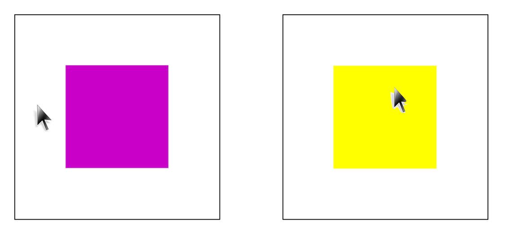
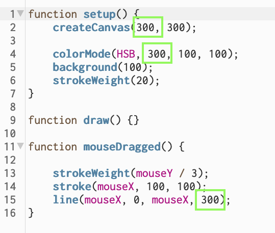
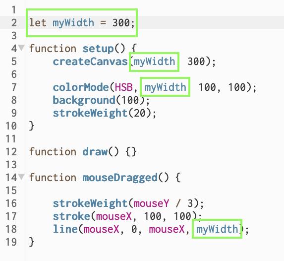

name: inverse
layout: true
class: center, middle, inverse
---

# Creative Coding for Beginners
### Film University Babelsberg KONRAD WOLF

Prof. Dr. Lena Gieseke | l.gieseke@filmuniversitaet.de 

---
layout:false


## Today

* Homework
    * Code Understanding
    * Your own examples
--
* Variables

---
## Homework

* Understand and explain [this code](https://editor.p5js.org/legie/sketches/4fWUhh9C8).

--

.center[]


???
.task[COMMENT:]  

* https://editor.p5js.org/legie/sketches/pQatzalNH

--
* Your examples

---
template:inverse

# Variables

---
## Learning Objectives

--

With this session you 

* understand how to work with data, and
* understand what the scope of a variable is, and
* how to animate certain properties, such as color and position.


---
## Variables

> What is a variable?

---
.header[Variables]

## Using The Same Value Multiple Times

<script type="text/p5" data-p5-version="1.6.0" data-autoplay data-height="450" data-preview-width="300" >
function setup() {
    createCanvas(300, 300);
    
    colorMode(HSB, 300, 100, 100);
    background(100);
    strokeWeight(20);
}

function draw() {
}

function mousePressed() {
    stroke(mouseX, 100, 100);
    line(mouseX, 0, mouseX, 300);
}
</script>

---
.header[Variables]

## Using The Same Value Multiple Times

.center[]


???
.task[COMMENT:]  

* When [drawing colorful lines](https://editor.p5js.org/legie/sketches/vcKXqzsgQ), we decided to use the width of our window as size for the value range for our color spectrum and so we had to paste the same value multiple times at different locations:
* This is tedious. If we want to test out different values for the window size we have to copy and paste the new value to all these places. Most likely we will forget one of the spots and create non-consistent behavior.

*How can we make this better?*


---
.header[Variables]

## Re-Using Values


.center[]


???
.task[COMMENT:]  


It would be great if we could define the value only once and then re-use or reference that value in the different places.

Well, variables enable us to do exactly that! Here a [quick preview](https://editor.p5js.org/legie/sketches/vcKXqzsgQ) before we get into the details about variables:

---
## Variables

.center[]


* One time definition of`myWidth` once (line 2) with the value `300`
* Multiple usages of `myWidth` 
* If we change `myWidth` in line 2, it is changed everywhere


---
## Variables

.center[]

A recipe needs ingredients.  
  
???
.task[COMMENT:]  

* Think back to the idea of understanding coding like creating a cooking recipe. In practice, a recipe only makes sense with the actual *ingredients* to cook with. 

--
  
In programming data is our ingredient and we access it with variables.

???
.task[COMMENT:]  

* Similarly, programming really only enfolds its full potential when working with data. You can think of the various forms of data such as a mouse click, text or numbers, as being the ingredients for programming.

---
.header[Variables]

## Data

Data can come in various forms, such as

--
* Images, video, sound files or streams

--
* User interaction

--
* Data defined by the programmer

--
* Data generated during the program


???
.task[COMMENT:]  

* In programming, data is saved in *variables*. 

Imagine variables as boxes in which you can put stuff and that

* boxes can be moved around,
* boxes can be empty, and
* what is inside a box can be changed.

---
## Variables

.center[]


---
.header[Variables]

## Initalization

 You use `let` exactly **once** for each variable: 

```js
let myWidth;
```

> `let` means something like *"create this variable"*


???
.task[COMMENT:]  

* Variables must be specifically created with the `let` keyword and any name of your choosing.

`myWidth` is not the best name. Usually you want to be as concise as possible with your variable names. However, here the name helps us to understand that this is a self-made name. We could have also used `hasi` (let's not do that thought...ever!) or almost anything really.

--

You should give the variable an initial value:

```js
let myWidth = 300;
```


--

```js
//Pseudo code

let variablename = value;
```

With the single `=` you assign a value to a variable.  


???
.task[COMMENT:]  

* Do not confuse this with the comparison operator `==`; in programming `=` (value assignment) and `==` (is equal test) are completely different things!
* If you do not initialize the variable when you create it, its value is *undefined* until you assign a value to it. Using a variable with a undefined value can lead to unexpected behavior and errors. Hence, get in the habit to always assign a value to a variable, when creating it.

---
.header[Variables]

## Using Variables

```js
let myDiameter = 10;

circle(50, 50, myDiameter);
print(myDiameter);
```


???
.task[COMMENT:]  

* After you created a variable and give it a value, you can work with the variable:
  
--

At all times you can change the value of a variable:

```js
myDiameter = myDiameter + 10;
```


???
.task[COMMENT:]  

As an [example](https://editor.p5js.org/legie/sketches/KR1qoukBx), we could increase the diameter with each mouse-click:

```js

```

Notice how we are using `print` to keep track of the variable value - just for our information.

---
.header[Variables]

## Errors

If you are trying to work with a variable that does not exists, p5 will throw an error:

```js
// Variable Error

    ...
    circle(mouseX, mouseY, myDiamete);
```

Error:

> ReferenceError: myDiamete is not defined.  
> 🌸 p5.js says: "myDiamete" is not defined in the current scope....

---
.header[Variables]

## Naming Conventions

Again, for programming, upper and lower case spelling matters!

```js
thisName != thisname
```
--

You must not use

* Umlaute, ß, or accents,
* names the p5 syntax is using, such as `let`, `function`,
* spaces and hyphen, or
* start with a number.

--

You should

* start with a small letter, and
* separate different words with camel case.

```js
thisNameIsAwesome
```

**Use sensible names!**

---
.header[Variables]

## Data Types


???
.task[COMMENT:]  

* The computer keeps track of the *type of data* that is inside of the box. For different data types, memory is allocated differently (you don't need to worry about memory allocation though).

So, be aware that data has a *type*. E.g., the type of `myDiameter` variable in the the above example is a *number*. The value you give a variable defines the type.

JavaScript is a loosely typed programming language. That means it is loose about data types 😊. That means that you can assign and re-assign values of all types to the same variable:

--

```js
let myVariable = 42;        // a number
myVariable     = 'hello';   // a string
myVariable     = true;      // a boolean

print(myVariable);
```

???
.task[COMMENT:]  


Just keep in the back of your head that this behavior makes JavaScript quite special. In most other programming language a variable can only accept values of the same type. In other programming languages the above example will create an error, saying that you can't assign 'hello' to a variable that was previously defined to store numbers.

---
.header[Variables]

## Data Types


| Data Type   | Description                                        | Example                          |
|-------------|----------------------------------------------------|----------------------------------|
| `String`    | represents textual data                            | `'hello'`, `"hello world!"` etc. |
| `Number`    | an integer or a floating-point number              | `3`, `3.234`, `3e-2` etc.        |
| `Boolean`   | Any of two values: true or false                   | `true` and `false`               |
| `undefined` | a data type whose variable is not initialized      | `let a;`                         |

???
.task[COMMENT:]  

* There are in total nine data types. We only care about `String` (textual data), `Number` (well... numbers 🙃), `Boolean` (true or false). and `undefined` (no value assigned).

For somewhat advanced knowledge, which you can also ignore, here all data types:

All data types except Object are called *primitive data types*, whereas Object is non-primitive. The non-primitive type Object can store collections of data, whereas primitive data type can only store a single data entity.

Good news, again, the only data types we care about are `String`, `Number`, `Boolean` and `undefined`.

[[3]](https://www.programiz.com/javascript/data-types)


#### print()

When working with a variable it is common practice while developing a program to print the value of a variable to know what is going on:

```js
let counter = 0;

// do stuff with counter

print(counter);
```


#### Summary Data Types

You can also check for the current type of a variable with the `typeof` command. It returns the type of that variable as a string.

```js
// Data Types


let wholeNumber = 10;
let floatingPointNumber = 10.25;
let truthValue = false;
let word = "Hello World";
let noValue;

print(typeof(wholeNumber));
print(typeof(floatingPointNumber));
print(typeof(truthValue));
print(typeof(word));
```

---
template:inverse

## Variable Scope


???
.task[COMMENT:]  

* 🚨 Attention: the following section is very important to understand... 🚨
* 🤓 ...but also a bit tricky!! 🤓 

---
## Variable Scope

Scope refers to the area in the code where you can access the variable, meaning *where it exists*.

--

The scope of a variable is defined by in which `{}` we create it:

```js
{
    // Variable only exists inside the brackets
    let myDiameter = 10;
}
```

--

**Variables only exist within the scope that we created the variable in!**

---
## Variable Scope

For all curly brackets scope applies in the same way.

```js
function setup() {

    // SCOPE 1
}

function draw() {

    // SCOPE 2
}
```


???
.task[COMMENT:]  

* Here it does not matter to what kind of code construct the curly brackets belong to. 
  
--

```js
if (name == 'ernie') {

    // SCOPE 1
} 
else {

    // SCOPE 2
}
```

---
## Variable Scope

```js
function setup() {

    // VARIABLE CREATION
    let myVariable = 10;

    print('1. print: ' + myVariable); 

}

function draw() {

    print('2. print: ' + myVariable); 
}
```


???
.task[COMMENT:]  

* What will happen in the following [example](https://editor.p5js.org/legie/sketches/yG1r_Epfe)?
* myVariable is out of scope here, meaning we can not access it

---
.header[Variable Scope]

## Nesting Scopes

--

Variables are visible from the [inside of the nested brackets](https://editor.p5js.org/legie/sketches/BGp6te8CY):

```js
function setup() {
    noLoop();
}

function draw() {

    // SCOPE 1
    let variableLevel1 = 1;

    if (variableLevel1 == 1) {
        // SCOPE 2

        // SCOPE 2 is nested in SCOPE 1
        // and we can access SCOPE 1's variables here:
        print(variableLevel1); // No error
    }
}
```

---
.header[Variable Scope]

## Nesting Scopes

.center[]

---
.header[Variable Scope]

## Nesting Scopes

```js
function draw() {

    let variableLevel1 = 1;

    if (variableLevel1 == 1) {

        print('1. print: ' + variableLevel1);

        let variableLevel2 = 2;
    }

    print('2. print: ' + variableLevel2); 
}
```


???
.task[COMMENT:]  

* Why does [the following](https://editor.p5js.org/legie/sketches/wRFErPBr5) throw an error?
* SCOPE 2 is nested in SCOPE 1 and can access SCOPE 1's variables
* We are back in SCOPE 1 variableLevel2 is out of scope here, meaning we can not access it

---
.header[Variable Scope]

## Global Scope

--

The **global scope** is one pair of `{}` around everything by default.

---
.header[Variable Scope]

## Global Scope

.center[]


---
.header[Variable Scope]

## Global Scope

```js
//SCOPE 0 - this variable visible everywhere!
let variableLevel0 = 1;

function setup() {
    noLoop();
}

function draw() {
    // SCOPE 1

    print('1. print: ' + variableLevel0);
    if (variableLevel0 == 1) {
        // SCOPE 2
        print('2. print: ' + variableLevel0)
    }
    print('3. print: ' + variableLevel0);
}
```

---
.header[Variable Scope]

## Global Scope

Global scope comes with many problems, 

--
e.g., it is difficult to keep track where the variable is changed in the code. 

--

**However, for beginners it is perfectly fine to use global variables.**


???
.task[COMMENT:]  

* In the upcoming weeks, we will most likely very often use variables that we define before any other code. Those variable we can use anywhere in the code and we do not need to worry about their scope, as they are in global scope.

We used global scope already in our very first example:

```js
let myDiameter = 10; //variable is visible everywhere

function setup() {
    createCanvas(400, 400);


    fill(0,0,255);
    noStroke();
}

function draw() {
  
    background(255);
    circle(mouseX, mouseY, myDiameter);

    print(myDiameter);
}


function mousePressed(){
  
    myDiameter = myDiameter + 1;
}
```

---
## Variables

### Summary

--
* You have to define a variable with `let` and a name of your choice.

--
* You should initialize a variable with a value, assigning a value with `=`.

--
* **Variables only exists inside of the `{}`, where they were created.**

--
* **If your variable behaves strangely, check its scope!**

.center[]

---
template:inverse

#### Application Example: Animation

## Change the Color of the Circle Automatically

---
## Change the Color of the Circle Automatically

* Create a variable for the hue of the fill color
* In each frame (meaning every time draw is called) count up a variable up 


???
.task[COMMENT:]  

Idea: in each frame (meaning every time draw is called) count up a variable and use that variable for the hue channel. Hence, the color should change smoothly by increasing its value one by one.

---
## Change the Color of the Circle Automatically

<script type="text/p5" data-p5-version="1.6.0" data-autoplay data-height="450" data-preview-width="300" >
function setup() {
    createCanvas(250, 250); 

    colorMode(HSB);
    background(100);
    fill(50, 100, 100);
    noStroke();
}

function draw() {

    fill(50, 100, 100);
    ellipse(mouseX, mouseY, 20, 20);
}
</script>


???
.task[COMMENT:]  

* Do it together

```js
// https://editor.p5js.org/legie/sketches/uaRTbFi0H
// Animating the Color of the Circle


// Creation and initialization
// of a new variable
let hue = 0;

function setup() {
    createCanvas(250, 250); 

    colorMode(HSB);
    background(100);
    fill(hue, 100, 100);
    noStroke();
}

function draw() {

    // Using the colorRed variable
    // as value for the red channel
    fill(hue, 100, 100);
    ellipse(mouseX, mouseY, 20, 20);

    // Increasing the value
    // in each draw() call
    hue = hue + 1;
    // print(hue);
}
```

--

... but wait. Why does the color stop changing after a while?


---
.header[Change the Color of the Circle Automatically]

## Why Does the Color Stop Changing?

We continuously increase the value for the `hue` variable and at some point its value is above 360.

???
.task[COMMENT:]  

* We continuously increase the value for the `hue` variable and at some point its value is above 360 (the default value range for the H channel). Hence, every value above 360 will just interpreted as 360 by p5. So when, e.g. `hue` is 500, the color looks like 360.

--

<script type="text/p5" data-p5-version="1.6.0" data-autoplay data-height="450" data-preview-width="300" >
let hue = 0;

function setup() {
    createCanvas(250, 250); 

    colorMode(HSB);
    background(100);
    fill(hue, 100, 100);
    noStroke();
}

function draw() {

    // Using the colorRed variable
    // as value for the red channel
    fill(hue, 100, 100);
    ellipse(mouseX, mouseY, 20, 20);

    // Increasing the value
    // in each draw() call
    hue = hue + 1;
    // print(hue);
}
</script>


???
.task[COMMENT:]  

In order to change this "overflow", we need to check for the possible value range of a color and make sure that hue only gets values 0..360.

```js
      // We check whether the value of
    // hue becomes larger than 360,
    // and if so we reset it back to zero.
    if(hue > 360){
        hue = 0;
    }

```

Similarly, we could animate the position of the circle.

---
## Change the Position of the Circle Automatically


???
.task[COMMENT:]  

* What are the steps?

--

<script type="text/p5" data-p5-version="1.6.0" data-autoplay data-height="450" data-preview-width="300" >
let hue = 0;
let positionX = 0;
let positionY = 0;
let speed = 2;

function setup() {
    createCanvas(250, 250); 

    colorMode(HSB);
    background(100);
    fill(hue, 100, 100);
    noStroke();
}

function draw() {

    fill(hue, 100, 100);
    ellipse(positionX, positionY, 20, 20);

    // POSITION
    // Increasing the position values
    positionX = positionX + speed;
    positionY = positionY + speed;

    // COLOR
    hue = hue + 1; 

    if(hue > 360){
        hue = 0;
    }
}
</script>


???
.task[COMMENT:]  

* [https://editor.p5js.org/legie/sketches/OljoriSe7](https://editor.p5js.org/legie/sketches/OljoriSe7)

Let's create two new variables for the position of the circle and one for its speed and use those variables for, well the position of the circle. In the same manner that we increase the hue variable, we can increase the position variable by speed:

In the same way that the hue value becomes larger than 360, the position variable become to large for the canvas and the circle runs out of the canvas. 

We can fix this by testing for the canvas size. For making that easier, let's use the system variable `windowWidth` and `windowHeight` the set the canvas size (otherwise I recommend to also create your own variables for the windows sizes).

Also, we are going to use the `or` operator with `|`, which connects two conditions. This means that only one of the two conditions (condition 1 is `positionX > windowWidth` and condition 2 is `positionX < 0`) needs to be true for the whole statement `condition 1 or condition 2` to be true.

---
## Change the Position of the Circle Automatically

<script type="text/p5" data-p5-version="1.6.0" data-autoplay data-height="450" data-preview-width="300" >
let hue = 0;
let positionX = 0;
let positionY = 0;
let speed = 2;

function setup() {
    createCanvas(windowWidth, windowHeight); 

    colorMode(HSB);
    background(100);
    fill(hue, 100, 100);
    noStroke();
}

function draw() {
    fill(hue, 100, 100);
    ellipse(positionX, positionY, 20, 20);
    
    // POSITION
    // Increasing the position values
    positionX = positionX + speed;
    positionY = positionY + speed;
  
    // If the x position runs out of the canvas, 
    // reset the position to 0
    if(positionX < 0 | positionX > windowWidth) {
        positionX = 0;
    }
    
    // If the y position runs out of the canvas, 
    // reset the position to 0
    if(positionY < 0 | positionY > windowHeight) {
        positionY = 0;
    }
  
    // HUE
    hue = hue + 1; 
    if(hue > 360){
        hue = 0;
    }
}
</script>


???
.task[COMMENT:]  

* [https://editor.p5js.org/legie/sketches/Rri_V0jph](https://editor.p5js.org/legie/sketches/Rri_V0jph)


In the above example, we reset the position to 0, creating a jump of the circle to the other side of the canvas again. How could we create the effect that the circle bounces of the sides of the canvas?

A solution could be to change the direction of the movement, when we hit the border of the canvas. We can change the direction by not adding `speed` to `positionX` and `positionY` but subtracting it!

So, first, when we start the program, we want that a postion is **increased** by speed (`positionX = positionX + speed;`) until it hits `windowWidth`. Then, we want to "switch direction" and **decrease** the `positionX` value (`positionX = positionX - 1;`) until it reached zero. Once it reached zero, we want to switch direction again and count up again, and so on and so on.

For that we can re-utilize our `speed` variable, also giving it a sign, meaning making it negativ, when we want to subtract values. However, we want to be able to control positionX and positionY independently, hence we also split speed int `speedX` and `speedY`.

---
## Change the Position of the Circle Automatically

> How to change direction?

--

---
## Change the Position of the Circle Automatically


<script type="text/p5" data-p5-version="1.6.0" data-autoplay data-height="450" data-preview-width="300" >

let hue = 0;
let positionX = 0;
let positionY = 0;
let speedX = 5;
let speedY = 5;

function setup() {
    createCanvas(windowWidth, windowHeight); 

    colorMode(HSB);
    background(100);
    fill(hue, 100, 100);
    noStroke();
}

function draw() {

    // Using the colorRed variable
    // as value for the red channel
    fill(hue, 100, 100);
    ellipse(positionX, positionY, 20, 20);
    
    // POSITION
    // Increasing the position values
    positionX = positionX + speedX;
    positionY = positionY + speedY;
  
    // If the x position runs out of the canvas, 
    // reset the position to 0
    if(positionX < 0 | positionX > windowWidth) {
        speedX = speedX * -1;
    }
    
    // If the y position runs out of the canvas, 
    // reset the position to 0
    if(positionY < 0 | positionY > windowHeight) {
        speedY = speedY * -1;
    }
  
    // HUE
    // Increasing the value
    // in each draw() call
    hue = hue + 1; 
    // We check whether the value of
    // hue becomes larger than 360,
    // and if so we reset it back to zero.
    if(hue > 360){
        hue = 0;
    }
}
</script>


???
.task[COMMENT:]  

* [https://editor.p5js.org/legie/sketches/D1R-Owv47](https://editor.p5js.org/legie/sketches/D1R-Owv47)
* Chose random start values

Further explanation:

```js
// Pseudo Code

let positionX = 0;
let speedX = 1;

...

positionX = positionX + speedX;

// This means as long as speedX is a positive number such as 1, we count positionX up:
// 1 = 0 + 1 
// 2 = 1 + 1
// 3 = 2 + 1
// 4 = 3 + 1
// ...

// When positionX becomes larger than windowWidth, we 
// multiply speedX by -1 so that speedX becomes equal -1

if(positionX > 255) {
    speedX = speedX * -1;
}

// 1 * -1 = -1 -> speedX is now -1

// This would work the same with any other value for speedX
// Let's say seepX is 5:
// 5 * -5 = -5 -> speedX is now -5


// Now when we count up positionX, we are actually doing a subtraction!

positionX = positionX + speedX;

// This means as long as speedX is -1, we count positionX DOWN:
// 360 + (-1) = 360 - 1 = 359
// 359 + (-1) = 358
// 358 + (-1) = 357
// ...

// Again, this would work the same with any other value for speedX
// Let's say seepX is now -5:
// 360 + (-5) = 360 - 5 = 355
// 355 + (-5) = 350
// 350 + (-5) = 345
// ...

// The if the case becomes true that positionX is smaller 0, 
// meaning running out of the canvas on the left side, we 
// multiply speed again with -1, making it positiv again:

// -1 * -1 = 1 -> speedX is now 1 again

// (negative multiplied by negative is positive again...)

```


---
.header[Variables]

## Summary

* We use variables to save and access data
    * `let hue = 0;`
    * Variables have a data type
    * Variables live inside `{}` and have a scope


Use the [reference](https://p5js.org/reference/) 🚒


---
template:inverse

The End  
  
# 🤯