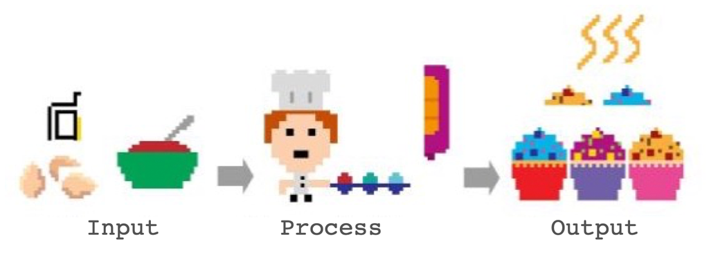
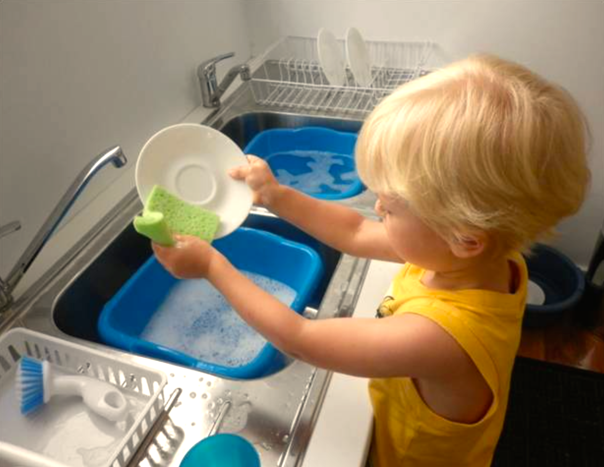

name: inverse
layout: true
class: center, middle, inverse
---

# Creative Coding for Beginners
### Film University Babelsberg KONRAD WOLF

Prof. Dr. Lena Gieseke | l.gieseke@filmuniversitaet.de 


---
layout:false

## Today

--
* Brief re-cap of everything so far
* Programming

--
* Images

---
## Today

.center[]


---
## Today

.center[]


---
template:inverse

##  What Happened So Far?

---
## What Happened So Far?

* p5.js Editor
    * The environment
    * Sketches
    * Errors (our friends!)
    * Saving
    * Sharing
--
* The system loop
    * `setup()`, `draw()`
--
* Function calls and function definitions
    * `circle(200, 200, 100);`
    * `function circle(xPosition, yPosition, radius){}`

---
## What Happened So Far?

* Drawing commands
    * `arc()`, `ellipse()`, `circle()`, `line()`, `rect()`, `square()`, `triangle()`
    * `fill(r, g, b)`, `stroke(r, g, b)`, `strokeWeight(w)`
--
* Color systems: RGB, HSB

--
* Interaction
    * System variables: `mouseX`, `key`, `keyPressed`, ...
    * Functions: `function mousePressed(){}`, `function keyPressed(){}`, ...
--
* Conditionals
    * `if(condition is true){}`
    * `else{}`
--
* Operators
    * Comparison: `>`, `>=`, `<`, `<=`, `==`, `!=`
    * Logical Operators: `&`, `|`, `!`
    * Arithmetic Operators: `+`, `-` , `*` , `/` , `++`, `--`, `+=`, `-=`, `*=`
---
## What Happened So Far?

* Variables
    * `let variableName = value;`
    * Variables have a data type
    * Variables live inside `{}` and have a scope
--
* Loops
    * `while(i < numberOfTimes){}`
    * `for(int i = 0; i < numberOfTimes; i++){}`

--

*For every row look at every element…*

```js
for (let y = 0; y < numberRows; y++)
{
    for (let x = 0; x < numberColumns; x++)
    {
        print("Row: " + y + " Column: " + x);
    }
}
```

---
.header[What Happened So Far?]

## Nested For Loops

<script type="text/p5" data-p5-version="1.6.0" data-autoplay data-height="400" data-preview-width="400" >
function setup() {
  createCanvas(300, 300);
}

function draw() {
    circle(75, 150, 50);
    circle(150, 150, 50);
    circle(225, 150, 50);
}
</script>


---
.header[What Happened So Far?]

## Nested For Loops

<script type="text/p5" data-p5-version="1.6.0" data-autoplay data-height="400" data-preview-width="400" >
function setup() {
  createCanvas(300, 300);
}

function draw() {

  for (let cx = 75; cx <= 225; cx += 75) {
    circle(cx, 150, 50);
  }
}
</script>

.footnote[[[Happy Coding]](https://happycoding.io/tutorials/p5js/for-loops)]

---
.header[What Happened So Far?]

## Nested For Loops

<script type="text/p5" data-p5-version="1.6.0" data-autoplay data-height="400" data-preview-width="400" >
function setup() {
  createCanvas(300, 300);
}

function draw() {

  for (let cx = 75; cx <= 225; cx += 75) {
    circle(cx, 75, 50);
  }

  for (let cx = 75; cx <= 225; cx += 75) {
    circle(cx, 150, 50);
  }

  for (let cx = 75; cx <= 225; cx += 75) {
    circle(cx, 225, 50);
  }
}
</script>

.footnote[[[Happy Coding]](https://happycoding.io/tutorials/p5js/for-loops)]


---
.header[What Happened So Far?]

## Nested For Loops

<script type="text/p5" data-p5-version="1.6.0" data-autoplay data-height="400" data-preview-width="400" >
function setup() {
  createCanvas(300, 300);
}

function draw() {

  for (let cy = 75; cy <= 225; cy += 75) {
    for (let cx = 75; cx <= 225; cx += 75) {
      circle(cx, cy, 50);
    }
  }
}
</script>

.footnote[[[Happy Coding]](https://happycoding.io/tutorials/p5js/for-loops)]

---
.header[What Happened So Far?]

## Nested For Loops

Homework...


---
## What Happened So Far?

* Programming

--
    * Break a problem into manageable pieces (*divide and conquer*)
--
    * Work with what you have
--
    * Test each step
--
    * Use `print` to check 
--
    * Do not copy the same code excessively
--
* Layout does matter
    * Represent the logic / structure
    * Prevent and find errors
--
* Errors are part of the process

--
* Use the reference, look at example code

--

### Further Questions?

---
template: inverse

# Programming?

---
template: inverse

## *Why Programming?*

---
layout: false

.header[Why Programming?]

## Computer Can Do It Better 🤖

--

* Task automatization / improvements

--
    * E.g., navigation

--

* Novel tasks

--
    * E.g., the internet

--

* For certain tasks, software…
    * …thinks faster
    * …has a better memory
    * …is better in multitasking
    * …is not getting tired

???

.task[ASK:]  

* How would you define creativity?

---
.header[Why Programming?]

## A Creative Process


???
.task[COMMENT:]  

* How would you define creativity?
* Programming is (often) a creative process

--

* You can create anything out of nothing

--
* Freedom of choice for a solution, many options

--
    * A bit like lego…

.center[]

--
* Results are easily shared

--
* Collaborative


---
.header[Why Programming?]

## Creative Coding

???
.task[COMMENT:]  

* How would you define creative coding?

--

* Producing something expressive rather than with practical use

--
* Software beyond its standard usage scenarios

--

> Aesthetics, insight, joy, communication, politics, augmentation, emotion, perspectives, friendship,...

---
.header[Why Programming? | Creative Coding]

## Meaning What?

--
* Algorithms and generative systems to create graphics and sounds

--
* Smart data sources
    * Images, video, sound
    * Camera and microphone
    * Online resources such as Twitter and Instagram
    * Mobile devices as sensors
    * ...
--
* Interesting output formats
    * Web
    * From large-scale such as buildings to small-scale such as smart watches
    * Multi-screen setups for example with mobile devices
    * ...

--

> What do we have available and what can we do with it beyond the obvious?


---
.header[Why Programming?]

## Become a Better You 😀

--

* Practice a systematic approach to problem solving

--

    * …reflect and come up with a plan
    * …divide and reduce
    * …reformulate
    * …start with what you know
    * …experiment
    * …working with the unknown
    * … build a healthy frustration tolerance and trust the process

---
.header[Why Programming?]

## Become a Better You 😀

* Please be gentle with yourself!
* You are learning a completely new skill
* You don’t know your approach yet

.center[[[tattly]](https://tattly.com/products/love-yourself)]

---
.header[Why Programming?]

## But I Hate Maths… 😳

--
* Programming in itself has nothing to do with maths  
    * Many programmers never use any maths at all
    * Certain applications might need maths, such as graphics and sound
--
* Programming is more like Sudoku
    * Solving one step at a time
    * Each step give hints for the next one
--
* Divide a problem into manageable sub-steps

.center[]

---
template: inverse

## *What is Programming?*


???
.task[COMMENT:]  

## What is Programming?
### To Command!

* Give commands to the computer
    * *Do this, then do that…*
    * *If this is true, do this; otherwise do that…*
    * *Do this 10 times…*
    * *Do this as long as…*

---
.header[What is Programming?]

## Like Writing a Recipe

.center[]

--

1. Write a recipe from scratch

--
2. Start with another recipe as basis

--
3. Use a can


???
.task[COMMENT:]  


## You Can Not Assume Anything…

You deal with an apprentice with zero experience!

* You: *Add a packet of butter.*
* Apprentice: *I don’t know what butter is.*
* You: *Butter is an ingredient and it is in the fridge. The fridge is in front of you. Butter is the packet on which there is written “butter”.*
* Apprentice: *And now what?*
* You: *Add the butter into the bowl.*
* You: *Remove the packaging first!*

--

> What you can assume the computer knows depends on the programming environment.


???
.task[COMMENT:]  


## It Is Not as Cryptic as You Might Think

```js
let points = 75;

if (points >= 50) {
    print("you won");
}
else {
    print("you lose");
}

print("done");
```

* Show maybe in editor
* https://editor.p5js.org/


---
template:inverse

## *What Are Programming Languages?*

---
.header[What Are Programming Languages?]

## Wikipedia says…

*A programming language is a **formal language**, which comprises a set of instructions that produce various kinds of output.*  

--

*Programming languages are used in computer programming to implement **algorithms.***

--

*A programming language's surface form is known as its **syntax.***


???
.task[COMMENT:]  

* There are hundreds of programming languages

--


We are using [JavaScript](https://developer.mozilla.org/en-US/docs/Web/javascript) in the class, which is the language for dynamic websites.

--
You can imagine p5 as an extension for JavaScript.

---
.header[What Are Programming Languages?]

## Algorithm?


*[…] an algorithm is a set of instructions, **typically to solve a class of problems** or perform a computation.*

*Algorithms are **unambiguous** specifications for performing calculation, data processing, automated reasoning, and other tasks.*

---
.header[What Are Programming Languages?]

## Syntax?

*[…] the syntax of a computer language is the set of rules that defines the **combinations of symbols** that are considered to be a **correctly structured** document or fragment in that language.*

---
.header[What Are Programming Languages?]

## Algorithms

*Give instructions for cleaning the dishes.*

--

.center[ [[source]](https://www.montessoriprivateacademy.com/wp-content/uploads/2015/11/montessori-washing-dishes.png)]

--
* With what are we working?
    * Inputs, data
--
* What is the process?


???
.task[COMMENT:]  

* (plate, sponge, water, tap, soap, dirt)

---
.header[What Are Programming Languages?]

## Algorithms

*Give instructions for cleaning the dishes.*


* Do you do different things based on **conditions**? 
* How do you use the words **if** or **otherwise** in your instructions? 
* Do you use the word **repeat** in your instructions?

---
.header[What Are Programming Languages? | Algorithms]

## Hello World 👋🏻

* Established as first “sanity check” for a programming language

--
* Text in- and output
    * Input: Program Code
    * Output: "Hello World"


???
.task[COMMENT:]  

* Show terminal

---
.header[What Are Programming Languages? | Algorithms]

## Hello World 👋🏻

.center[[[wiki]](https://de.wikipedia.org/wiki/Liste_von_Hallo-Welt-Programmen/Höhere_Programmiersprachen#Java)]

---
.header[What Are Programming Languages? | Algorithms]

## Hello World 👋🏻

### But Why?

* Tradition
* First used by Brian Kernighan, 1974 in the Bell Laboratories
* http://helloworldcollection.de
    * 567 Hello World programs

???


[[wikipedia]](https://de.wikipedia.org/wiki/Liste_von_Hallo-Welt-Programmen/H%C3%B6here_Programmiersprachen)


---
.header[What Are Programming Languages? | Algorithms]

## Hello World in p5.js?

p5.js is optimized for designer and artists to develop graphics, sound and interaction.

--

* Input: Program Code
* Output: Graphics

--

```js

function setup() {
    createCanvas(100, 100);
    background(255);
}

function draw() {
    point(50, 50);
}
```

???

.task[TASK:]  

* Show [Sketch](https://openprocessing.org/sketch/1011532)


[[1]](https://de.wikipedia.org/wiki/Liste_von_Hallo-Welt-Programmen/H%C3%B6here_Programmiersprachen)


---
.header[What Are Programming Languages?]

## Shouldn’t We Rather Learn ___?

--

* The friend of my friend of my friend says…

--
* Which programming language someone prefers is somewhat of a religion and also depends on what you are used to.

--
* There is always the next “hot topics”.

--
* The one programming language to learn doesn’t exists.
    * They all have advantages and disadvantages.
    * It depends on specific application scenarios.
--
* p5.js is a good introduction
    * Especially for designer, artists, etc.
    * Everything you learn with p5.js, you can transfer to another programming language

---

## References

[[1] Wikipedia - Liste von Hallo-Welt-Programmen/Höhere Programmiersprachen](https://de.wikipedia.org/wiki/Liste_von_Hallo-Welt-Programmen/H%C3%B6here_Programmiersprachen)  


---
template:inverse

# The End  

# 🕺🏻 💙 🤖