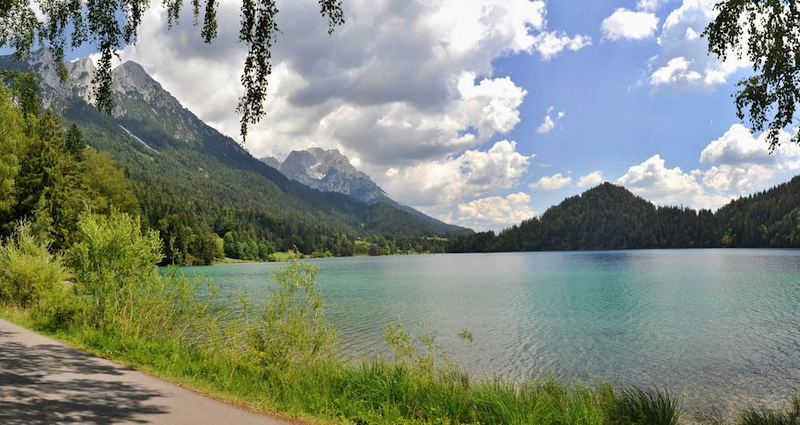

name: inverse
layout: true
class: center, middle, inverse
---

# Creative Coding for Beginners
### Film University Babelsberg KONRAD WOLF

Prof. Dr. Lena Gieseke | l.gieseke@filmuniversitaet.de 


---

# Images

---
layout:false

## Images

* Load & Display
* Image Manipulations
* Spritesheet animation

--

### Learning Objectives

With this topic you

* know how to work with images,
* understand how to manipulate images, and
* understand the concept of image animations.

---
layout:false

## Loading And Displaying Images

The steps to load and display an image are as follows:

--
* Add an image file to your project folder

--
* Load that image in your program and make it accessible with a (global) variable

--
* Display the image 


---
## Loading Images

Images should be loaded in the `preload()` function. 

```js

function preload() {
    
    // Image loading
}
```

* `setup()` waits until any load calls in `preload` have finished

--
* `setup()` does not have this waiting behavior, hence if we would do the loading in setup, the `draw()` calls might start before the loading is actually done.


???
.task[COMMENT:]  

* As you already know the setup() function is called before our draw() loop starts. But Javascript is asynchronous, meaning that it allows multiple things to happen at the same time. So if we would load our image in setup(), it could happen that the image file is still not fully loaded before it's needed in another line of code. Therefore it's better to use another built-in function of p5: preload().


---

## Loading And Displaying Images

You have to add the image to you project.


???
.task[COMMENT:]  

Show it in the editor.

* Click the > button just under the play button to expand the list of files in your sketch. You should see index.html, sketch.js, and style.css.
* Click the dropdown menu next to Sketch Files and then click Upload file.
* In the window that pops up, drag a file or click to select a file. When your file is done uploading, close the file selector window.

--

```js
let imgPanda;

function preload() {
    imgPanda = loadImage("panda.jpg");
}

function setup() {
    createCanvas(600, 600);
    background(200);
}

function draw() {
    image(imgPanda, 50, 50);
}
```


???
.task[COMMENT:]  

* The loadImage command loads an image from the given path. Because we uploaded our file to this sketch in OpenProcessing, we can just use the filename "panda.jpg". We could also put in a URL to an image file here.
* When we run our sketch, p5 calls preload() first, and then pauses execution until loadImage has finished loading our image file.

---

## Loading And Displaying Images

`loadImage(path)`

* Path of the image to be loaded
* Returns the p5 image object

--

`image(img, x, y, [width], [height])`


* Image variable
* Position on the x axis (upper-left corner)
* Position on the y axis (upper-left corner):
* Optional: width of the displayed image
* Optional: height of the displayed image

???
.task[COMMENT:]  

* Note that the reference point for positioning the images is the upper-left corner (for ellipses it is the center).
* Since we leave out width and height, the image is displayed in its full dimensions.

---

## Displaying Images

```js
let imgPanda;

function preload() {
  imgPanda = loadImage("panda.jpg");
}

function setup() {
  createCanvas(windowWidth, windowHeight);
}

function draw() {

  for (let y = 0; y < height; y += imgPanda.height) {
    for (let x = 0; x < width; x += imgPanda.width) {

      image(imgPanda, x, y);
    }
  }
}
```

[→ p5 Editor - Displaying Images](https://editor.p5js.org/legie/sketches/Ebb3xKiDV)


---

## Accessing the Image Object

--

```js
let imgPanda = loadImage("panda.jpg");
```

`loadImage` gives us an [**image object**](https://p5js.org/reference/#/p5.Image).

--

Objects have properties and functions that *belong to* them.

--

.center[]

---

## Accessing the Image Object

```js
let imgPanda = loadImage("panda.jpg");
```

`loadImage` gives us an [**image object**](https://p5js.org/reference/#/p5.Image).
  
Objects have properties and functions that *belong to* them.

These properties and functions are accessed through the object with the `.` syntax:

--

```js
imgPanda.height
imgPanda.width

imgPanda.resize(100, 100);
```

--

[→ p5 Editor - Resizing Images](https://editor.p5js.org/legie/sketches/SLLLmgMX_)


???

* Here `resize` is not a property but a function that *belongs to* an image. The function can only work with an image and needs to know which image to work with.
* Scale proportionally using 0 as width or height:
    * img.resize(200, 0); // Scales the image to a width of 200px, keeping its original proportions


## Modifying the Image Data

Tint an image to specified colors or make it transparent:

```js
tint(v1, v2, v3, [alpha]);
```


* There's a simple command called tint, which sets the "fill" value for displaying images


Tint an image to specified colors or make it transparent:

```js
tint(v1, v2, v3, [alpha]);
```

Remove the current tint value:

```js
noTint();
```

* And exactly like there's noFill() to remove the current fill value, there's noTint() to remove the current tint value
* Show how to use it
* https://www.openprocessing.org/sketch/1052031


---

## Animating Images

The image parameters, e.g. its position, can be animated like any other shape in p5.

--

```js

function draw() {

    background(255);
  
    // POSITION
    // Increasing the position values
    positionX = positionX + speedX;
    positionY = positionY + speedY;
  
    // If the x position runs out of the canvas, 
    // reset the position to 0
    if(positionX < 0 | positionX > windowWidth - imgPanda.width) {
        speedX = speedX * -1;
    }
    
    // If the y position runs out of the canvas, 
    // reset the position to 0
    if(positionY < 0 | positionY > windowHeight - imgPanda.height) {
        speedY = speedY * -1;
    }
  
    image(imgPanda, positionX, positionY);
}

```


[→ p5 Editor - Animating Images](https://editor.p5js.org/legie/sketches/NA8Sqzyis)


???

* Images can be animated like any other shape in p5
* https://editor.p5js.org/legie/sketches/NA8Sqzyis


---
template:inverse

# Pixel Data


---

## Pixel Data

.center[]

---

## Pixel Data

.center[]

???

* It basically is an array or a matrix of single square pixels, which are just color values
* How can we modify those pixel values?

---

## Reading Pixel Data

Return the color of an image at the specific pixel coordinate:

```js
let img;

...

img.get(x, y);
```

--

The color of the pixel is returned as an array of [R,G,B,A] values.

--

[→ p5 Editor - Reading Pixel Data](https://editor.p5js.org/legie/sketches/H6uqSnexq)


???

## Setting Pixel Data

* Where we have get(), we of course also have set()


Setting the color of a pixel consists of three steps:

* Loading the pixel data
* Setting the pixel color
* Updating the pixel data


```js
let img;

...

img.loadPixels();
img.set(x, y, color);
img.updatePixels();
```


The color of the pixel can be set as an array of [R,G,B,A] values.


* And it works quite similar, but instead of just returning the color value you can define and change the pixel
* Show example
* https://openprocessing.org/sketch/1256883

---
template: inverse

# Examples

???

* Now we will have a look at some examples for creative image manipulations using the techniques you just learned

---
## Pointillism

.center[]

---
## Fake Pointillism


.center[]

???

* The first is this one: Pointillism. Can someone tell me what we see here?
* Single pixels are represented as circles
* Circles are placed on top of each other

* Steps:
  * Pick a random point
  * Look up the RGB color in the source image
  * Draw a circle at the pixel’s position with the pixel’s color

https://editor.p5js.org/legie/sketches/GN4wMPz4x


---
## Fake Pointillism


.center[ ]

--

### What do we see?

--
* Circles are placed on top of each other

--
* The circle's color is based on the loaded image

--
* The color is picked at the circle's location

--

### Steps?

--
* Pick a random point

--
* Look up the RGB color in the source image

--
* Draw a circle at the pixel’s position with the pixel’s color

--
* Repeat


???
.task[COMMENT:]  

* https://editor.p5js.org/legie/sketches/IqIwCw4yt


```
function draw() {
	//image(img, 0, 0);
	
	let x = random(img.width);
	let y = random(img.height);
	
	let c = img.get(x, y);
	
	// Adjusting alpha
	//c[3] = 100;
	
	fill(c);
	ellipse(x, y, brushSize, brushSize);
	
	//print(c);

}

```

---

## Stretching


---

## Stretching


--

### What do we see?

--
* Horizontal lines for the full height of the image but in length only from left to the mouse position

--
* The colors of the vertical line at the mouse position are taken for horizontal lines

--

### Steps?

--
* Iterate through the column where the mouse is at

--
* Detect the pixel’s color with get()

--
* Draw a line from x = 0 to the column (mouseX) in the detected color

--
* Repeat


???
.task[COMMENT:]  

https://editor.p5js.org/legie/sketches/S9Er5W47G


```js
function draw() {

	image(img, 0, 0);


	// Go through all lines of the image from top to bottom
	for (let i = 0; i < img.height; i++) {

		let c = img.get(mouseX, i);

		// To define a line color
		// stroke() is used
		stroke(c);

		// Draw a line from the
		// left edge of the sketch window
		// up to the mouse x position
		line(0, i, mouseX, i);
		//circle(mouseX, i, 100);
	}

}

```


<!-- ---

## Tiling


.center[]

???

* What do we see?
  * A specific cutout of the image is “tiled"
  * The image cutout for the tiles should beextracted at the mouse position

* Steps:
  * Cut a piece of the image at the mouse location and display it
  * Create the tiles 1. A variable for the number of tiles 2. The tile size depends then on the sketch window size
  * Iterate in x and y with the size of the tile as step size and draw the same cutout at each position.

https://openprocessing.org/sketch/1257098 -->

---

## Brownian Motion Lines

.center[]


???

* This one is called Brownian Motion Lines
* Brown was a Scottish botanist in the 18th century who was examining the random motion of particles in liquids and gas

* We see a line that get's continuously drawn and moves forward randomly in a small range

https://openprocessing.org/sketch/1256917

---

## Brownian Motion Lines

.center[]


???

* This one is called Brownian Motion Lines
* Brown was a Scottish botanist in the 18th century who was examining the random motion of particles in liquids and gas

* We see a line that get's continuously drawn and moves forward randomly in a small range

https://editor.p5js.org/legie/sketches/WWsJj-V0D

---

## Brownian Motion Lines


--

### What do we see?

--
* Connected lines are continuously drawn

--
* The lines have random end points

--
* The color is picked at the lines's from the image
  
--

### Steps?

--
* Save the end point of the previous line

--
* Get the color of that end point and set it

--
* Generate a random point within a certain range

--
* Draw a line with the previous end point as start and the random point as end

--
* Repeat


???
.task[COMMENT:]  

* https://editor.p5js.org/legie/sketches/qbqPJppbI

```js

function draw() {
	//image(img, 0, 0);

	// Compute new end value
	let nextX = lastX + random(-range, range);
	let nextY = lastY + random(-range, range);

	// Constrain all points to borders of the sketch
	nextX = constrain(nextX, 0, width);
	nextY = constrain(nextY, 0, height);

	let pix = img.get(nextX, nextY);
	stroke(pix);
	line(lastX, lastY, nextX, nextY);

	lastX = nextX;
	lastY = nextY;
}
```


---
template:inverse

# Summary

---
## Summary

Use the `preload()` function to make sure your image files are fully loaded before working with them

```
let img;

function preload() {
    img = loadImage("myImage.jpg");
}

function draw() {
    image(img, 0, 0);
}
```

--

Images are object and contain properties and functions

```js
imgPanda.height
imgPanda.width

imgPanda.resize(100, 100);
```
--

Use the [reference](https://p5js.org/reference/) 🚒

---
template:inverse

# *The End*

# 🏇 📷  🖼️
