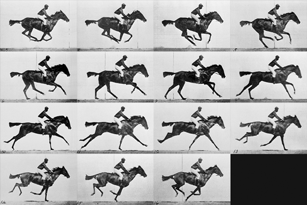

name: inverse
layout: true
class: center, middle, inverse
---

# Creative Coding for Beginners
### Film University Babelsberg KONRAD WOLF

Prof. Dr. Lena Gieseke | l.gieseke@filmuniversitaet.de 

---
layout:false
# Algorithmic Thinking

How do you decide what to wear in the morning?

---
.[Algorithmic Thinking]

## How To Play This Game?

Which parts are matching and which differ from player to player? Using pattern matching and abstraction!

.center[]

---
.[Algorithmic Thinking]

## How To Play This Game?

Which parts are matching and which differ from player to player? Using pattern matching and abstraction!

.center[]


---
.[Algorithmic Thinking]

## How To Play This Game?

Which parts are matching and which differ from player to player? Using pattern matching and abstraction!


  
Color:
1) Red
2) Blue
3) Yellow
4) Green
5) Pink
6) Black
  
Items:
1) Cell Phone
2) Pineapple
3) Book
4) Cupcake
5) Tentacle
6) Bow
  
Part:
1) Head
2) Tail
3) Foot
4) Belly
5) Nose
6) Back


???
.task[COMMENT:]  

Figure out how to play this game by looking at the players’ phrases below. Circle the matching parts and underline words that are different from player to player. The first matching section has been circled for you.


---
template:inverse

# Images

---


## Images

* Load & Display ✓
* Image Manipulations ✓
* Spritesheet animation 

---
## Images

```js
let img;

function preload() {
    img = loadImage("myImage.jpg");
}

function draw() {
    image(img, 0, 0);
}
```

---
## Images


```js
imgPanda.height
imgPanda.width

imgPanda.resize(100, 100);
```

--

Images are object and contain properties and functions.


---
## Fake Pointillism

.center[ ]


???
.task[COMMENT:]  


https://editor.p5js.org/legie/sketches/AYPVipmgS


## Brownian Motion Lines

.center[]


???

* This one is called Brownian Motion Lines
* Brown was a Scottish botanist in the 18th century who was examining the random motion of particles in liquids and gas

* We see a line that get's continuously drawn and moves forward randomly in a small range

https://openprocessing.org/sketch/1256917

---

## Brownian Motion Lines

.center[]


???

* This one is called Brownian Motion Lines
* Brown was a Scottish botanist in the 18th century who was examining the random motion of particles in liquids and gas

* We see a line that get's continuously drawn and moves forward randomly in a small range

https://editor.p5js.org/legie/sketches/WWsJj-V0D

---

## Brownian Motion Lines


--

### What do we see?

--
* Connected lines are continuously drawn

--
* The lines have random end points

--
* The color is picked from the image at the lines position
  
--

### Steps?

--
* Save the end point of the previous line

--
* Get the color of that end point and set it

--
* Generate a random point within a certain range

--
* Draw a line with the previous end point as start and the random point as end

--
* Repeat


???
.task[COMMENT:]  

* https://editor.p5js.org/legie/sketches/qbqPJppbI

```js

function draw() {
	//image(img, 0, 0);

	// Compute new end value
	let nextX = lastX + random(-range, range);
	let nextY = lastY + random(-range, range);

	// Constrain all points to borders of the sketch
	nextX = constrain(nextX, 0, width);
	nextY = constrain(nextY, 0, height);

	let pix = img.get(nextX, nextY);
	stroke(pix);
	line(lastX, lastY, nextX, nextY);

	lastX = nextX;
	lastY = nextY;
}
```

https://editor.p5js.org/legie/sketches/WWsJj-V0D


---
## Homework

## Task 06.02 - Image Manipulation

---
template:inverse

# Spritesheet Animation

---
## Spritesheet Animation




???

* Another way of bringing images to live is to use a series of still images and display them in a fast sequence
* This technique was "invented" in 1872 by Eadweard Muybridge
* He was commissioned to prove whether a horse lifted all four legs off the ground at once when it ran
* To do so, he set up a series of cameras along a track and took pictures in quick succession as a horse ran by
* This process allowed him to capture 16 pictures of the horse's run
* In one of the pictures, the horse did indeed have all four legs off the ground

* Muybridge later repeated the experiment and placed each photo onto a device that could project the photos in rapid succession to give the illusion of the horse running, creating the first movie projector!
* We will now recreate Muybridge's animation of the horse
* https://openprocessing.org/sketch/1042250


---
## Spritesheet Animation

.center[]

--
Approach

--
* Load all images

--
* With each draw call display the images in sequence

---
## Spritesheet Animation


 ...


--

```js
let numberImg = 15; // Number of images
let imgIndex = 0;   // Index of the image currently displayed
```

--
```js
image(imgIndex, 0, 0); // Displaying the image
```
--

```js
imgIndex++; // Next image

if (imgIndex == numberImg) { // Reached last image
    imgIndex = 0 // Back to first image
}
```


???
.task[COMMENT:]  

This will display a different image every frame, which might be too fast.

---
.header[Spritesheet Animation]

## Display The Images In Sequence

We only want to switch images every n-th frame.

--

```js
let animationSlowDown = 5; // The higher the value, the slower the animation
```

--
```js
if (frameCount % animationSlowDown == 0) { // Every 5th frame

    imgIndex++; // Next image

    if (imgIndex == numberImg) { // Reached last image
        imgIndex = 0 // Back to first image
    }
}
```

* `frameCount` continuously grows
* We only increase the number if `frameCount` is evenly dividable by `animationSlowDown`
 
---
.header[Spritesheet Animation]

## The Modulo Operator %

The modulo operator (%) returns for a division with a whole number the rest of that division

```html
1 / 5 is 0 with rest 1
2 / 5 is 0 with rest 2
...
```

--

```js
0 % 5 = 0       <=
1 % 5 = 1
2 % 5 = 2
3 % 5 = 3
4 % 5 = 4
5 % 5 = 0       <=
6 % 5 = 1
7 % 5 = 2
8 % 5 = 3
...
```


---
.header[Spritesheet Animation]

## The Modulo Operator %

`frameCount` contains the number of frames that have been displayed since the program started.


If we combine modulo with frameCount we can write an if clause that let's us do something every nth frame:

```js
if (frameCount % animationSlowDown == 0) { // Every 5th frame

    imgIndex++; // Next image

    if (imgIndex == numberImg) { // Reached last image
        imgIndex = 0 // Back to first image
    }
}
```


???
.task[COMMENT:]  


frameCount is a system variable of p5, that contains the number of frames that have been displayed since the program started.


https://editor.p5js.org/legie/sketches/1ro3D8eFD


---
## Spritesheet Animation

This can't be good:

```js
    img0 = loadImage("frame-0.jpg");
    img1 = loadImage("frame-1.jpg");
    img2 = loadImage("frame-2.jpg");
    img3 = loadImage("frame-3.jpg");
    img4 = loadImage("frame-4.jpg");
    img5 = loadImage("frame-5.jpg");
    img6 = loadImage("frame-6.jpg");
    img7 = loadImage("frame-7.jpg");
    img8 = loadImage("frame-8.jpg");
    img9 = loadImage("frame-9.jpg");
    img10 = loadImage("frame-10.jpg");
    img11 = loadImage("frame-11.jpg");
    img12 = loadImage("frame-12.jpg");
    img13 = loadImage("frame-13.jpg");
    img14 = loadImage("frame-14.jpg");
```

--
Rule of thumb: don't copy similar code more than three times.

--

Instead look for patterns, abstractions, etc.


---
## Spritesheet Animation

What if we could save all images in one variable and access that variable with `imgIndex`?

```js

// Pseudo code
let allImages = image1, image2, image3; 

...

image("take the first image in allImages", 0, 0);
```


---

# Arrays to The Rescue! 🚨

--

Arrays let us save multiple elements into **one** variable.  


???
.task[COMMENT:]  

That makes it easy to work with many, many values at the same time, while still saving for each element a different value.


---

## Array

Conceptually, you can imagine an array as follows. While a "normal" variable looks like:

 [[pinimg]](https://s-media-cache-ak0.pinimg.com/originals/29/e5/e8/29e5e884709323402933b3e3b73dbbb8.jpg)

```js
let molly = 🐱;
```

---

## Array

Then an array can be described as:

 [[kittentoob]](http://kittentoob.com/wp-content/uploads/2012/04/cat-pics31.jpg)

```js
let kitties = [🐱,🐯];
```


---
.header[Array]

## Example

<script type="text/p5" data-p5-version="1.6.0" data-autoplay data-height="300" data-preview-width="400" >
// Arrays

let width0 = 120;
let width1 = 140;
let width2 = 160;
let width3 = 180;
let width4 = 200;
let width5 = 220;
let width6 = 240;
let width7 = 260;
let width8 = 280;
let width9 = 300;

function setup() {
	createCanvas(400, 400);
	background(220);
	fill(255, 0, 255);
	noStroke();
}

function draw() {
	rect(0, 120, width0, 10);
	rect(0, 140, width1, 10);
	rect(0, 160, width2, 10);
	rect(0, 180, width3, 10);
	rect(0, 200, width4, 10);
	rect(0, 220, width5, 10);
	rect(0, 240, width6, 10);
	rect(0, 260, width7, 10);
	rect(0, 280, width8, 10);
	rect(0, 300, width9, 10);
}
</script>


???
.task[COMMENT:]  

* https://editor.p5js.org/legie/sketches/Tibg5JjP8
* 


---
.header[Array]

## Definition & Initalization

```js
let variableName = [value1, value2];
let variableName2 = [];
```

--

* An ordered collection of values
* Can store elements of any type

--

```js
let widths = [500, 610, 830, 690, 710, 500, 290, 310, 170, 390];
let emptyArr = [];
let fruits = ["Apple", "Orange", "Plum"];

// mix of values
let mixed = [ 'Apple', 2, true, 'hehe'];
```

---
.header[Array]

## Access

```js
let fruits = ["Apple", "Orange", "Plum"];
  
print(fruits[i]);
```

--
A specific element in the array is accessed over an index inside of the `[]`.  


--

**Indices start at 0!**

---
.header[Array]

## Access

.center[]

---
.header[Array]

## Access

.center[]


---

## Array

We can use an array to store the width values and make the code more compact:

```js

let widths = [120, 140, 160, 180, 200, 220, 240, 260, 280, 300];

function setup() {...}

function draw() {

    rect(0, widths[0], widths[0], 10);
    rect(0, widths[1], widths[1], 10);
    rect(0, widths[2], widths[2], 10);
    rect(0, widths[3], widths[3], 10);
    rect(0, widths[4], widths[4], 10);
    rect(0, widths[5], widths[5], 10);
    rect(0, widths[6], widths[6], 10);
    rect(0, widths[7], widths[7], 10);
    rect(0, widths[8], widths[8], 10);
    rect(0, widths[9], widths[9], 10);
}
```


???
.task[COMMENT:]  

* What else could we do to make this code more compact?


---
.header[Array]

## Access

We can also use a loop to access the elements in an array. 

`array.length` , which gives us the number of elements in an array:

```js
// https://editor.p5js.org/legie/sketches/bLIR07Yrp


let widths = [120, 140, 160, 180, 200, 220, 240, 260, 280, 300];

function setup() {...}

function draw() {

    for (let i = 0; i < widths.length; i++) {
        rect(0, widths[i], widths[i], 10);
    }
}
```

---
.header[Array]

## `widths.length`?

An array is an object and comes with its own properties and functions.

--

`widths.length`

`length` is a property of an array. This is part of JavaScript.  


---
.header[Array]

## Access


---
.header[Array]

## Access

If you access an array element, which you haven't assigned a value to, you will get `undfined` as value.

```js
// https://editor.p5js.org/legie/sketches/lNm2CJTeq


let widths = [120, 140, 160, 180, 200, 220, 240, 260, 280, 300];

...

// There is no value for
// the element with the index 20
print(widths[20]); // undefined
```


???
.task[COMMENT:]  

If we don't need the specific index of the iteration, we can also use a special `for..of` loop syntax for arrays:

```js
let fruits = ["Apple", "Orange", "Plum"];

// Special loop to iterate over array elements
for (let f of fruits) 
{
    print( f );
}
```

```js
// The above is the same as
for (let i = 0; i < fruits.length; i++) 
{
    print( fruits[i] );
}
```

---
template:inverse

## Push and Pop

---

## Push and Pop

The array object comes with the functions `push` and `pop`.  

--
* `push` appends an element to the end to an array  

--
* `pop` removes the last element of an array

--

```js
// https://www.openprocessing.org/sketch/1034520

let fruits = ["Apple", "Orange", "Plum"];

fruits.push("Banana");

print(fruits) // ["Apple", "Orange", "Plum", "Banana"];
```
--
```js
fruits.pop();

print(fruits) // ["Apple", "Orange", "Plum"];
```


<!-- https://stackoverflow.com/questions/5767325/how-can-i-remove-a-specific-item-from-an-array -->

---

## Example Spriteanimation


[→ p5 Editor - Spriteanimation](https://editor.p5js.org/legie/sketches/iWvfAz3Is)
  
--
  
[→ p5 Editor - Game Step 01](https://editor.p5js.org/legie/sketches/6XvbzAE8Z)  
[→ p5 Editor - Game Step 02](https://editor.p5js.org/legie/sketches/m5Z-lTkXB)


???
.task[COMMENT:]  

* https://editor.p5js.org/legie/sketches/lLIapghZK


---


## Summary

With arrays we can save multiple values in one variable.

--

```js
let myArray = [2, 4, 6, 8];
```

--

Arrays are accessed with `[]` and an index, starting at `0`.

--

```js
print(myArray[2]); // 6
```

--

You can use loops to access all elements of an array.

--

```js
for (let i = 0; i < myArray.length; i++) {
    print('Element', i, ': ', myArray[i]);
}
```

--

* `push` adds a new element to the end of an array 
* `pop` remove the last element of an array

--

### Use the [reference](https://p5js.org/reference/) 🚒


---
template:inverse

## The End

## 👩🏽‍🤝‍👨🏼  👩‍👧‍👦  👨‍👨‍👧‍👧 