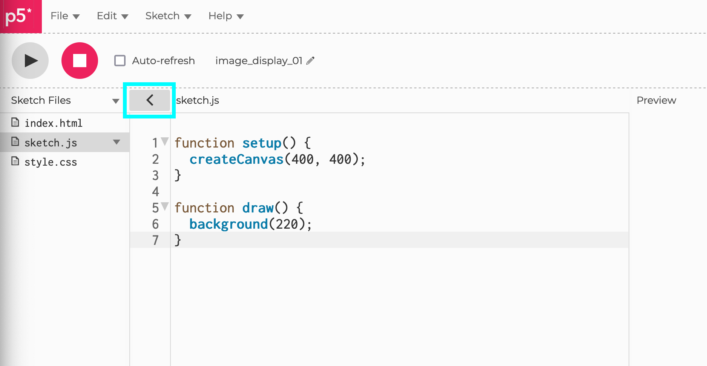

name: inverse
layout: true
class: center, middle, inverse
---

# Creative Coding for Beginners
### Film University Babelsberg KONRAD WOLF

Prof. Dr. Lena Gieseke | l.gieseke@filmuniversitaet.de 

---
layout:false
# Algorithmic Thinking

--
The goal is an **algorithm**:

* Define a list of steps to finish a task

.footnote[[[code.org]](https://code.org/curriculum/course3/1/Teacher)]

  
--
For defining an algorithm, you might need:

--
  
* **Decomposition**: Break a problem down into smaller pieces

--
* **Abstraction**: Reduce specific differences and make one solution work for multiple cases

--
* **Pattern Matching**: Find similarities


---
.header[Algorithmic Thinking]

## Example

> Sum up all numbers between 1-200. 

---
.header[Algorithmic Thinking]

## Example

### Decomposition

--

Let's start at the two ends:

* 1 + 200
* 2 + 199
* 3 + 198
* 4 + 197
* ...

--

### Pattern Matching

Each pair results in the sum of 201!
  
--

How many of these pairs will we have? 

--
* The last pair, we can create is 100 + 101
* That means that we have 100 total pairs

---
.header[Algorithmic Thinking]

## Example

> Sum up all numbers between 1-200. 


**The answer is 100 * 201 = 20100!**

--
* We have 100 pairs
* Each pair's sum is 201

--

> How about the sum of all numbers between 1-20000?  

--
> Or rather between 1-n?

--

### Abstraction

--

**The answer is (n \* 0.5) \* (n + 1)!**


???
.task[COMMENT:]  

* https://betterexplained.com/articles/techniques-for-adding-the-numbers-1-to-100/


---
template:inverse

# Arrays


???
.task[COMMENT:]  

* Is what?

---


## Arrays

With arrays we can save multiple values in one variable.

```js
let myArray = [2, 4, 6, 8];
```

--

Arrays are accessed with `[]` and an index, starting at `0`.


```js
print(myArray[2]); // 6
```

--

You can use loops to access all elements of an array.

```js
for (let i = 0; i < myArray.length; i++) {
    print('Element', i, ': ', myArray[i]);
}
```

--

* `push` adds a new element to the end of an array 
* `pop` remove the last element of an array

---
## Homework

--

### Task 07.02 - Confetti

Take the animation of a circle code and convert it to creating multiple circles (confetti!) at the same time.


???
.task[COMMENT:]  

* https://editor.p5js.org/legie/sketches/LyTHREIeS

--

### Task 07.03 - Functions

Use the code of step 2 of the game and add functions to the code to make it more readable. The goal is to keep setup() and draw() as organized as possible.


???
.task[COMMENT:]  

* https://editor.p5js.org/legie/sketches/xxakpSxmn

---
## Today

--
* Sound

--
* Libraries

--
* Anatomy of a webpage


???
.task[COMMENT:]  

* https://editor.p5js.org/legie/sketches/2nuJGEvFr


---
## The Jumping Game

> How to add sound?

--

Sound is not directly available as functionality in p5.

--

We have to load a library for it.

---
template: inverse

# Libraries

---

## Libraries

* p5 extends JavaScript

???
.task[COMMENT:]  

* The same way p5 is written to extend the base functionality of JavaScript, we can write code that further extends p5.  

--
* Additional libraries extend p5, e.g., for sound

???

* A library is code in regard to a certain topic, e.g. sound, that is somewhat generalized and of use in various contexts.
* Libraries should be compact and also as small as possible. That is one of the reasons why additional libraries are not simply added to p5 itself. 
 
--
* Written by different people


???
.task[COMMENT:]  

* Libraries are mostly written by other people or teams and it is easier to manage to keep the development of an additional library separated.


---

## Libraries

### Examples

Use the [ml5](https://learn.ml5js.org) for machine learning in an accessible and easy way.

.center[[[ml5]](https://learn.ml5js.org)]

---

## Libraries

### Examples

A library to create a [scribble effect](https://github.com/generative-light/p5.scribble.js):

 [[p5.scribble]](https://github.com/generative-light/p5.scribble.js)


???
.task[COMMENT:]  

* https://editor.p5js.org/legie/sketches/PtoiQsgKr


---

## Libraries

### Examples

A library to create a [a touch gui](https://github.com/L05/p5.touchgui):

.center[]  [[p5.touchgui]](https://github.com/L05/p5.touchgui)

---

## Libraries

You can find a list of the currently supported p5 libraries [on the p5 website](https://p5js.org/libraries/).

--

> Depending on your tasks, using a library can make your life much easier.

--

Keep in mind 

* The quality of the code and its documentation might vary

--
* If a library is listed on the official p5 website, it is probably ok

---

## Libraries

For loading libraries we have to take a look behind the scenes...

---
template: inverse

# The Anatomy of a Webpage

---
.header[The Anatomy of a Webpage]

## Behind The Scenes

.center[]

---

## The Anatomy of a Webpage

* `index.html`
* `style.css`
* `sketch.js`

---

## The Anatomy of a Webpage

* `index.html` (***displaying***)
* `style.css` 
* `sketch.js`

---

## The Anatomy of a Webpage

* `index.html` (***displaying***)
* `style.css` (***styling***)
* `sketch.js` 

---

## The Anatomy of a Webpage

* `index.html` (***displaying***)
* `style.css` (***styling***)
* `sketch.js` (***interacting***)

---
.header[Anatomy of a Webpage]

## Html

Tags for formatting content that displays a webpage:

```html
<!DOCTYPE html>
<html>
	<head>
		<title>A Very Important Webpage</title>
	</head>
	<body>
		<h1>Hello World</h1>
		<p>This is a paragraph.</p>
	</body>
</html>
```

---
.header[Anatomy of a Webpage]

## Html

```html
<!DOCTYPE html>
<html lang="en">
  <head>
    <script src="https://cdnjs.cloudflare.com/ajax/libs/p5.js/1.6.0/p5.js"></script>
    <script src="https://cdnjs.cloudflare.com/ajax/libs/p5.js/1.6.0/addons/p5.sound.min.js"></script>
    <link rel="stylesheet" type="text/css" href="style.css">
    <meta charset="utf-8" />

  </head>
  <body>
    <main>
    </main>
    <script src="sketch.js"></script>
  </body>
</html>
```

--

In the html file, we must link any other relevant files, such as `.css` or `.js`.


???
.task[COMMENT:]  

* Add the hello world code


---
.header[Anatomy of a Webpage]

## CSS

Styles html elements, identified by selectors (e.g., their tag name).

--

Linking in the `.html`:

```html
<link rel="stylesheet" type="text/css" href="style.css">
```

--

The `.css` file:

```css
body {
  background: yellow;
}
```

???
.task[COMMENT:]  

* Add css code

---
.header[Anatomy of a Webpage]

## JavaScript

Enables a webpage to be interactive. This is, e.g., our p5 `sketch.js` file. 

--

Linking in the `.html`:

```html
<script src="sketch.js"></script>
```

--

The `sketch.js` file:

```js
function setup() {
  createCanvas(400, 400);
}

function draw() {
  background(220);
}
```


???
.task[COMMENT:]  

* https://editor.p5js.org/KevinWorkman/sketches/PnmzefAsr


---
.header[Anatomy of a Webpage]

## Libraries

--

```html
<!DOCTYPE html>
<html lang="en">
  <head>
    <script src="https://cdnjs.cloudflare.com/ajax/libs/p5.js/1.6.0/p5.js"></script>
    <script src="https://cdnjs.cloudflare.com/ajax/libs/p5.js/1.6.0/addons/p5.sound.min.js"></script>

    <script src="p5.scribble.js"></script>


    <link rel="stylesheet" type="text/css" href="style.css">
    <meta charset="utf-8" />

  </head>
  <body>
    <main>
    </main>
    <script src="sketch.js"></script>
  </body>
</html>
```

--
* Accessed by a give online link
* Add file to project


???
.task[COMMENT:]  

* https://idmnyu.github.io/p5.js-speech/
* Since recently, the sound library is already linked by default.

---
template:inverse

# The Sound Library


---

## Sound

Since recently, the [sound library](https://p5js.org/reference/#/libraries/p5.sound) is already linked by default.

```html
<script src="https://cdnjs.cloudflare.com/ajax/libs/p5.js/1.6.0/addons/p5.sound.min.js"></script>
```

--

This library is actually developed by the p5 team and is therefore also [documented on the p5 website](https://p5js.org/reference/#/libraries/p5.sound).  

--

There is a lot of functionality provided to work with sound and [many examples given](https://p5js.org/examples/).

---

## Sound

Working with sound files follows pretty much the same logic as working with images:

--
* Add the sound files as asset to your sketch

--
* Load the sound file and...

--
* ...save it in a variable

--
* Work with that variable

---

## Sound

### Loading And Playing A Sound File

The most basic functions for working with a [sound variable](https://p5js.org/reference/#/p5.SoundFile) are:

* start()
* stop()
* pause()

--

These functions belong to the sound object, hence you have to attach them to them by a dot:

```js
let sound = loadSound(...);

sound.start();
sound.stop();
```

---

## Sound

### Loading And Playing A Sound File

--

```js
// Source: https://p5js.org/examples/sound-load-and-play-sound.html
// https://editor.p5js.org/legie/sketches/GDm7gNbaa

// A sound file object
let jinggle;

function preload() {
    jinggle = loadSound('blues_string.mp3');
}

function setup() {
    createCanvas(windowWidth, windowHeight);
    background(255, 0, 0);
}

function mousePressed() {
  
    // .isPlaying() returns a boolean  
    if (jinggle.isPlaying()) {
        jinggle.stop();
        background(255, 0, 0);
    } else {
        jinggle.play();
        background(0, 255, 0);
    }
}
```


---

## Sound

### PlayMode

A p5.SoundFile has two play modes 

--

* `restart`
* `sustain`

The play mode determines what happens to a p5.SoundFile if it is triggered while in the middle of playback.  


---

## Sound

### PlayMode

A p5.SoundFile has two play modes 

* `restart`: add a new playback
* `sustain`: stop and start over

The play mode determines what happens to a p5.SoundFile if it is triggered while in the middle of playback.  


---

## Sound

### PlayMode

```js
// https://editor.p5js.org/legie/sketches/MhBMTNwFs

let jinggle;

function preload() {
	jinggle = loadSound('blues_string.mp3');
}

function setup() {
	createCanvas(windowWidth, windowHeight);
	
	//jinggle.playMode('restart');
	jinggle.playMode('sustain');
}

function mousePressed() {
	
	background(random(255));
	jinggle.play();
}
```

---

## Sound


As said before, there are many, many more given functions to work with sound. For example, you can also record sound with p5.


---
.header[The Jumping Game]

## Adding Background Music


Of course, you can also add a song to the world, which continuously plays in loop.  


???

I add this to the background tab, as to me it feels like "background music" but you could also structure your game differently, e.g. adding the sound to mySketch. 

--

For looping a sound, you can simply call `soundBackground.loop();`. We can also reduce the file's volume a bit with [`setVolume()`](https://p5js.org/reference/#/p5.SoundFile/setVolume).

---
.header[The Jumping Game]

## Adding Background Music


```js
// Jumping Game - Sound Loop
// https://editor.p5js.org/legie/sketches/_Fn4xTETJ


let bgSound;

function loadBackground() {
    ...

    // Loading the soundfile
    bgSound = loadSound('theme_loop.wav');
}

function initBackground() {
    ...
    
    // Repeating the sound file
    bgSound.loop();
    
    // Reducing the volume with 
    // a value between 0 (no sound) to 1 (full volume)
    bgSound.setVolume(0.1);
}
...
```

---
.header[The Jumping Game]

## Coins


???
.task[COMMENT:]  

* Show result: https://editor.p5js.org/legie/sketches/_Fn4xTETJ

--

```js
function initCoin() {
    // Place the coin at the right side of the screen...
    coinX = bgImg.width;

    // ...at a random height between
    // 100 (because we don't want the coin too high)
    // and
    // the sketch height minus the coin image size
    // minus the ground height visible at the background image
    coinY = random(100, height - coinSize - bgGroundHeight);
    coinCollected = false;
}
```
--

```
    // Move the coin to the left (with the background)
    coinX -= bgSpeed;
```

---
.header[The Jumping Game]

## Coin - Player Collision

We simply want a coin to disappear ("being collected") when the player collides with it. 


???
.task[COMMENT:]  

* We will add counting points later.

--
* New variable `let coinCollected = false;`

???
.task[COMMENT:]  

* For tracking whether a coin is collected or not, add in the coin tab a global variable for that, e.g. `coinCollected` and set it to `false`.
* Think about it for a moment how you could detect a collision between the player and the coin. Feel free to use your own solution for that. One possibility is to set a collision to `true`, 
--
* Measure distance between player and coin

```js
dist(coinX, coinY, playerX, playerY) <= playerSize * 0.5 + coinSize * 0.5
```


???
.task[COMMENT:]  

* if the distance between the player and the coin positions is equal or less than both of their "radii" (half their size). 
* https://p5js.org/reference/#/p5/dist

--
* If distance becomes too small, set `coinCollected = true;`

```js
    if (dist(coinX, coinY, playerX, playerY) <= playerSize/2 + coinSize/2) {
        coinCollected = true;
    }
```
--

What should happen if `coinCollected` is true?

--
* Delete the old coin, start a new one

???
.task[COMMENT:]  

* For that we can simply call the `initCoin` function. And we already have the code for that in the `animateCoin` function for the case of the coin moving outside of the screen on the left. To this check we can add a condition which checks for `coinCollected` to be true and modify the "out of screen check" from step 4 to the following:

---
.header[The Jumping Game]

## Coin - Player Collision

```js
    // Give the coin a new position when it left the screen or got collected
    if (coinCollected) {
        initCoin();
    }
```


???
.task[COMMENT:]  

Make sure that the above code comes after the `if (dist(...)){}` check. Also, very important: we also need to set `coinCollected` back to false (otherwise no new coins will re-appear). Add that to the `initCoin()` function.

--

* We should also init a new coin, if the old one runs out of the canvas

--

```js
    // Give the coin a new position when it left the screen or got collected
    if (coinX <= 0 - coinImg[1].width || coinCollected) {
        initCoin();
    }
```


---
.header[The Jumping Game]

## Sound Effect For Coins

Adding a sound effect to a game whenever a player collected a point could look as follows.  

???

For that we need to load the sound file and play it upon player-coin collision. As the sound somewhat "belongs" to a coin, we add the code to the coin tab. 
  
Start: https://editor.p5js.org/legie/sketches/Zj1vmVWWT

---

```js
// Jumping Game - Sound Coins
// https://editor.p5js.org/legie/sketches/_Fn4xTETJ

// Sound Variable
let soundCollected;

function loadCoin() {

    ...

    // Loading the sound file, saving it in soundCollected
    soundCollected = loadSound('coin_collected.wav');
    soundCollected.playMode('restart');
}

function animateCoin() {

    ...

    // Check for collision between coin and player:
    // They collide if the distance between their positions is equal or less
    // than both of their "radiuses" (half their size)
    if (dist(coinX, coinY, playerX, playerY) <= playerSize / 2 + coinSize / 2) {
        coinCollected = true;

        // Playing the sound effect
        soundCollected.play();
    }

    ...
}
```


???
.task[COMMENT:]  

* https://editor.p5js.org/legie/sketches/_Fn4xTETJ


---
.header[The Jumping Game]

## File Structure

--

The same way we can load libraries, we can split our `sketch.js` and load those files.

--

* `sketch.js`
* `background.js`
* `player.js`
* `coin.js`

--

`Sketch Files` -> `Create File`

--

```html
    <script src="background.js"></script>
    <script src="player.js"></script>
    <script src="coin.js"></script>
```

--

This is exactly the same as having all code in one file.


???
.task[COMMENT:]  

* https://editor.p5js.org/legie/sketches/2nuJGEvFr


---
template:inverse

# Summary

---

## Summary

--

Libraries

--
* Libraries extend p5 in regard to one specific topic

--
* You have to load and link a library for a sketch

--
* For knowing how to use a library you have to refer to the library's given documentation, it is not necessarily on the p5 page
  
---

## Summary

[p5.sound](https://p5js.org/reference/#/libraries/p5.sound)

--

Loading a sound file:

```js 
let song;

function preload() {
    song = loadSound('song.mp3');
}
```

--

```js
song.playMode('restart');
song.setVolume(0.1);
song.play();

...

song.stop();
```

--

Use the [reference](https://p5js.org/reference/) 🚒


---
template:inverse

## The End

# 📚 🎹 🎧

